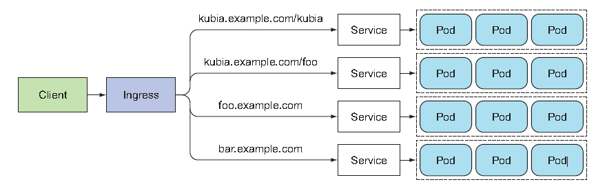
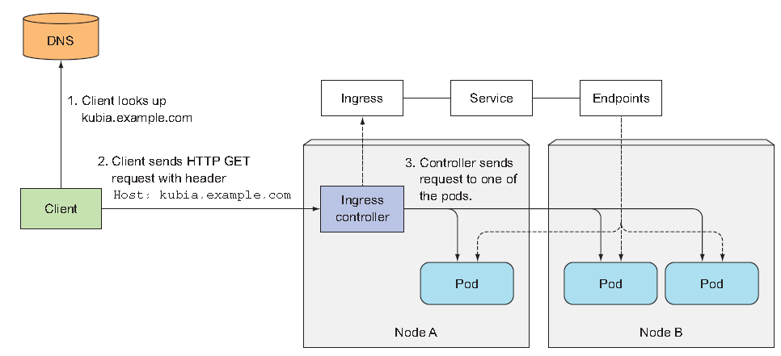

# Services: enabling clients to discover and talk to pods
This chapter covers:
- Creating Service resources to expose a group of pods *at a single address*
- Discovering services in the cluster
- Exposing services to external clients
- Connecting to external services from inside the cluster
- Controlling whether a pod is ready to be part of the service or not
- Troubleshooting services

## Why and What Service?
Pods needs a way of finding other pods if they want to consume the services they provide. In non-Kubernetes world, where sysadmin would configure each client app by specifying the exact IP address or hostname of the server providing the service in the client's configuration files, doing the same wouldn't work in Kubernetes because:
- ***Pods are ephemeral***
- ***Kubernetes assigns an IP address to a pod after the pod has been scheduled to a node and before it's started***
- ***Horizontal scaling means multiple pods may provide the same service*** so clients shouldn't care how many pods are backing the service and their IPs.
<br>

For the above reasons, we need some resources that have ***single and constant point of entry*** to a group of pods providing the same service; hence the name ***Service***. To put it in another way, each Service has an IP address and port that never change while the Service exists.<br><br>

Let's take this example. You have frontend web server and backend database server. There may be multiple pods that act as frontend which clients shouldn't care about and only a single DB pod. <br>
In this particular situation, by creating a *Service for the frontend* pods and configuring it to be accessible from outside the cluster, you expose a single, constant IP address. Similarly, by also creating a *Service for backend* pod, you create stable address for the backend pod.

### Creating services
Again, a Service can be backed by more than one pod. *Connections to the service are load-balanced* across all the backing pods. But how exactly do you define which pods are part of the service and which aren't? The *Labels and Selectors* are used again as core mechanism. To test out service, let's create ReplcationController which run three instances of the pods again. 

```yaml
apiVersion: v1
kind: ReplicationController
metadata:
  name: migo-rc
spec:
  replica: 3
  selector:        
    app: migo-pod
  template:
    metadata:
      labels: 
        app: migo-pod
    spec:
      containers:
        - name: migo-con
          image: saka1023/k8s
          ports:
            - containerPort: 8080
```
```sh
kubectl apply -f "rc name"
```

Now, let's create a Service through a YAML descriptor.
*svc.yaml*
```yaml
apiVersion: v1
kind: Service
metadata:
  name: migo-svc
spec:
  ports:
    - port: 80          #The port this service will be available on
      targetPort: 8080  #The container port the service will forward to
  selector:
    app: migo-pod       #All pods with the app=migo-pod label will be part of this service
```
```sh
kubectl apply -f "svc.yaml"
```
<br>

Let's examine our new service:
```sh
kubectl get svc
NAME         TYPE        CLUSTER-IP      EXTERNAL-IP   PORT(S)   AGE
kubernetes   ClusterIP   10.96.0.1       <none>        443/TCP   11d
migo-svc     ClusterIP   10.109.52.156   <none>        80/TCP    7s
```
The list shows that IP address assigned to the service is 10.109.52.156. Because this is the *ClusterIP*, it's only accessible from inside the cluster.<br><br>

*Testing the Service from within the cluster*<br>
You can send requests to your service in a few ways:
- Create a pod that sends the request to the service's clusterIP and log the response.
- You can ssh into one of the Kubenetes nodes and use the curl command
- You can execute the *curl* command inside one of your existing pods through the *kubectl exec* command.
Let's go for the last option.
```sh
kubectl get pods
NAME                              READY   STATUS    RESTARTS   AGE
migo-deployment-cc4c757f6-2mpxm   1/1     Running   0          14h
migo-deployment-cc4c757f6-fffcr   1/1     Running   0          14h
migo-deployment-cc4c757f6-kctlm   1/1     Running   0          14h  #take this one

kubectl exec migo-deployment-cc4c757f6-kctlm -- curl -s http://10.109.52.156
You've hit migo-deployment-cc4c757f6-fffcr
```
You will see, every time you execute the command, service redirects HTTP connection to a randomly selected pod.

### Configuring session affinity on the Service
If you want all requests made by a certain client to be redicted to the same pod every time, you can set the service's ***sessionAffinity*** property to ClientIP(default to None):
```yaml
apiVersion: v1
kind: Service
metadata:
  name: migo-svc
spec:
  sessionAffinity: ClientIP  #this makes traffic from same client go to the same pod
  ports:
    - port: 80
      targetPort: 8080
  selector:
    app: migo-pod
```
Kubernetes has no cookie-based session affinity option as it doesn't operate on HTTP level. Service instead deals with TCP and UDP packets and don't care about payload they carry.

### Exposing mutiple ports in the same service
Even if your pods listened on two ports - say 8080 for HTTP and 8443 for HTTPS, you don't need to create two different services in such cases. The spec for a multi-port Service is shown in the following listing:
```yaml
apiVersion: v1
kind: Service
metadata: 
  name: migo-svc-multiport
spec:
  ports:
    - name: http
      port: 80
      targetPort: 8080
    - name: https
      port: 443
      targetPort: 8443
  selector:
    app: migo-pod
```
As you can see, when creating Service with multiple ports, you MUST specify a name for each port. Plus, the label selector applies to the service as a whole - it can't be configured for each port individually. If you want different ports to map to different subsets of pods, you need to create two services.<br>

### using NAMED pods
You've referred to targetPort by its number, but you can also give a name to each pod's port and refer to it by name in the service spec. For example, suppose your pod defines names for its ports as shown in the following listing:
```yaml
apiVersion: v1
kind: Pod
metadata:
  name: migo-pod
  labels: 
    app: migo-pod
spec:
  containers:
    - name: migo-con
      image: saka1023/k8s
      ports:
        - name: http
          containerPort: 8080
        - name: https
          containerPort: 8443
```
And then you refer to named ports in a service
```yaml
apiVersion: v1
kind: Service
spec:
  ports:
    - name: http
      port: 80
      targetPort: http  #Port 80 is mapped to the container's port called 'http'
    - name: https
      port: 443
      targetPort: https #Port 443 is mapped to the container's port called 'https'
```
The biggest benefit of doing this is it enables you to change port numbers later without having to change the service spec. 

### Discovering services
How do the client pods know the IP and port of a service? Do you need to create service first and manually look up its IP address? Not really. Kubernetes provides ways for client pods to discover a service's IP and port as follows:
- Through Environment variables
- Through DNS(FQDN)


*Discovering Service through Environment variable*<br>
If you create a service before creating the client pods, process in those pods can get the IP address and port of the service by inspecting their environment variables. If you already had pods, you can delete them and let controllers spin them back up. And then list environment variable by executing:
```sh
kubectl exec "pod_name" env
PATH= ...
...
MIGO_SERVICE_HOST=10.111.249.153  # This is the cluster IP of the service
MIGO_SERVICE_PORT=80              # And this is the port the service is available on
```
Note that dashes in the service name are converted to underscores and all letters are uppercased. <br><br>

*Discovering Service through DNS*<br>
One of the namespaces preset is *kube-system* namespacecs and one of its pods is called *kube-dns*. This pod runs a DNS server, which all other pods running in the clsuter are automatically configured to use(K8S does this by modifying each container's /etc/resolv.conf file)<br><br>

Each service gets a DNS entry in the internal DNS server, and client pods that know the name of the service can access it through its ***fully qualified domain name(FQDN)***. So revisiting the frontend-backend, for example, a frontend pod can connect to the backend database by openning a connection to the following FQDN:<br><br>

    backend-database.default.svc.cluster.local
- backend-database : the name of the service.
- default : namespace.
- svc.cluster.local : configurable cluster domain suffix.

Connecting to a service can be even simpler than that. You can omit the *svc.cluster.local* suffix and even the namespace, when pods that are trying to connect to the service are in the same namesapce. Let's try this:
```sh
#Open bash shell session of one of the pods
kubectl exec -it "pod_name" -- bash

#Inside the container, send curl command
curl http://migo.default.svc.cluster.local
curl http://migo.default
curl http://migo
```
<br>
The last three will all work. Look at the /etc/resolv.conf file in the container and you'll understand why you can omit the suffix part.
```sh
cat /etc/resolv.conf
```

Note that while *curl*-ing the service works fine, ping-ing it doesn't. That's because the service's clusterIP is a virtual IP and only has meaning when combined with the service port. This will be revisited later.<br>

## Connecting to services living outside the cluster
Cases exist when you'd like to expose external services through the Kubernetes services feature. In this subsection, how you could manage them will be discussed.

### Service endpoints
Firstly, it's worth talking about what Service really is. Services don't link to pods directly. If you use *kubectl describe* command on your service, it shows you:
```sh
kubectl describe svc migo-svc
Name:              migo-svc
Namespace:         default
...
...
Selector:          pod=migo-pod
Type:              ClusterIP
...
Endpoints:         172.17.0.10:8080,172.17.0.4:8080,172.17.0.9:8080
```
Here, Selector is used to create the list of endpoints and the actual Endpoints(plural) are presensted in the form of IPs and ports. Endpoint resource is like any other K8S resource, so you can display its basic info with kubectl get: 
```sh
kubectl get endpoints migo-svc
NAME       ENDPOINTS                                          AGE
migo-svc   172.17.0.10:8080,172.17.0.4:8080,172.17.0.9:8080   9h
```
<br>

The idea is decoupling services and endpoints so you can configure and update endpoints manually. How do you do that? - That's as simple as creating a service without a pod selector. And then it's up to you to create Endpoint resources to specify the list of endpoints for the service. Let's do it in action:<br>
```yaml
apiVersion: v1
kind: Service
metadata: 
  name: external-endpoint  # This must be matched with the name of the Endpoints obejct
spec:                      # No selector defined
  ports:
    - port: 80 
```
```yaml
apiVersion: v1
kind: Endpoints
metadata:
  name: external-endpoint  # This must be matched with the name of the Service object
subsets:
  - addresses:
    - ip: 11.11.11.11      # The IPs of the endpoints that the service will forward
    - ip: 22.22.22.22      # connections to 
    ports:
      - port: 80           # Tartget port of the endpoints
```
The Endpoints object needs to have the same name as the service. And to reiterate, containers created after the service is created will include the environment variables for the service.<br>

### Creating an alias for an external service
Instead of exposing external service manually, a simpler method may allow you to refer to an external service by its FQDN. To do that, create a Service resource with the ***type*** field set to ***ExternalName***: 
```yaml
apiVersion: v1
kind: Service
metadata:
  name: external-service
spec:
  type: ExternalName                # Service type is set to ExternalName
  externalName: abc.company.com     # FQDN of the actual service
  ports:
    - port: 80
```
After the service is created, pods can connect to the external service through:
- *external-service.default.svc.cluster.local*
- *external-service.default*
- *external-service*
This way, you can modify the service definition and point it to a different service anytime later by only changing the *externalName* attribute.<br>*ExternalName* services are implemneted soley at the DNS level - simple CNAME DNS record is created for the service. Therefore, clients using this service will connect to external servicec directly, bypassing the service completely. For this reason, these types of services don't even get a clusterIP.<br>

## Exposing services to external clients
Sometimes, you'll also want to expose certain services like frontend web servers to the outside.<br>
For that, you have a few ways:
- Setting the service type to ***NodePort***
- Setting the service type to ***LoadBalancer***
- Creating an ***Ingress resource*** - This operates at the HTTP level

### Using a NodePort Service
When creating NodePort service, you make K8S reserve a port on *ALL* its nodes and forward incoming connections to the pods that are part of the service. NodePort can be accessed not only through service's internal clusterIP but also through any node's IP and the reserved node port. See the following listing:
```yaml
apiVersion: v1
kind: Service
metadata:
  name: migo-nodeport
spec:
  type: NodePort            # Set the service type to NodePort
  ports:
    - port: 80              # Port of the service's internal clusterIP
      targetPort: 8080      # This is the target port of the backing pods
      nodePort: 32067       # The service will be accessible through port 30123 of each of your cluster nodes
  selector:
    app: migo-pod
```
Specifying the *nodePort* is optional. If you don't K8s will choose a random port. 
```sh
kubectl get svc
NAME            TYPE        CLUSTER-IP      EXTERNAL-IP   PORT(S)        AGE
migo-nodeport   NodePort    10.98.43.60     <none>        80:32067/TCP   8s
```
Look at *EXTERNAL-IP* column. It shows < nodes >, indicating the service is accessible through the IP address of any cluster node. To put it in another way, The service is accessible at the following addresses:
- 10.98.43.60:80
- "1st_node's IP":32067
- "2st_node's IP":32067
Before you can access your service through the node port, you need to configure the firewall pocity to allow external connections to your nodes on that port. On GCP, you can do that by:
```sh
gcloud compute firewall-rules create migo-svc-rule --allow=tcp:32067
```
So now, you can access your service through port 32067 of one of the nodes' IPs. But to do that, you need to figure out the IP of a node first. 
```sh
#On minikube
minikube service migo-nodeport
* Opening service default/migo-nodeport in default browser...
  http://192.168.49.2:32302

#On GCP
kubectl get nodes -o jsonpath='{.items[*].status.addresses[?(@.type=="ExternalIP")].address}'

#curl-ing
curl http://192.168.49.2:32302
You've hit migo-deployment-cc4c757f6-fffcr
```
A fatal flaw of NodePort is if you only point your clients to the first node, when that node fails, your clients can't access the service anymore. That's why it makes sense to put a loadbalancer in front of the nodes to make sure you're *spreading* requests acress all healthy nodes and never sending them to a node that's offline.

### Exposing a service through LoadBalancer
All you need to do is just replace service's type to ***LoadBalancer*** instead of *NodePort*. The load balancer will have its own unique, publicly accessible IP address and will redirect all connections to your service. Be aware that Loadbalancer is an extension of a NodePort Service. Here's the listing:
```yaml
apiVersion: v1
kind: LoadBalancer
metadata:
  name: migo-loadbalancer
spec:
  type: LoadBalancer          #This type of service obtains a loadbalancer from the infrastructure hosting the K8s cluster
  ports:
    - port: 80
      targetPort: 8080
  selector:
    app: migo-pod
```
As your service is now exposed externally, you may try accessing it with your *web server*. You may see the browser hits the eact same pod every time. Even with *Session Affinity* not being changed(set to None) it behaves like that because browser is using keep-alive conections and sends all its requests through a single connection. *curl* command opens a new connection every time so it wouldn't happen.

### Understanding the peculiarities of external connections.
There are things that you must be aware related to externally originating connections to internal services:
- ***Network hops***
    When an external client connects to a service through the *NodePort* or *LoadBalancer*, the randomly chosen pod may or may not be running on the same node that received the connection, resulting in additional network hop being required. You can prevent this by configuring the service to redirect external traffic only to pods on the node that received connection. This is done by following annotation:
    ```yaml
    spec:
      externalTrafficPolicy: Local
    ```
    The problem is, if no local pods exist, the connection will hang. You therefore need to ensure the load balancer forwards connections only to nodes that have at least one such pod. The other drawback is connections will not be spread evenly across the pods.
- ***Non-preservation of the client IP***
    Usually, the pods backing a service can obtain the client's IP address when clients inside the cluster connect to the service. But when the connection is received through a node port, the packets' source IP is changed because Source Network Address Translation(SNAT) is performed on the packets. The *Local* external traffic policy affects the preservation of client IP as there wouldn't be additional hop(SNAT not performed)

## Exposing services externally through an Ingress
### Understanding Why Ingresses are needed
One important reason is each *LoadBalancer* service requires its own load-balancer with its own public IP address, whereas an Ingress only requires one, even when providing access to dozens of services. When a clinet sends an HTTP request to the Ingress, the host and path in the request determine which service the request is forwarded to.

<br>
Ingress operate at the application layer of the network stack(HTTP) and can provide features such as cookie-based session affinity and the like, which Services can't.

### Understanding that an *Ingress Controller* is required
To make Ingress resources work, an Ingress controller needs to be running in the cluster. Initially Minikube didn't provide a controller, but it now includes an add-on that can be enabled to let you try out the Ingress functionality. To enable the Ingress add-on in Minikube:
```sh
#To see the whole list of addons
minikube addons list

#To enable ingress
minikube addons enable ingress
* Verifying ingress addon...
* The 'ingress' addon is enabled
```
The above command should have spun up an Ingress Controller as another pod. To confirm this, run ***kubectl get po --all-namespaces***

### Creating an Ingress resource
Now, you can create an Ingress resource:
```yaml
apiVersion: networking.k8s.io/v1
kind: Ingress
metadata:
  name: migo-ingress
spec:
  rules:
  - host: migo.example.com # This maps "migo.example.com" domain name to your service
    http: 
      paths:
        - path: /          # All requests will be sent to port 80 of migo-nodeport service
          pathType: Exact  # or Prefix
          backend:
            service:
              name: migo-nodeport
              port: 
                number: 80
```
Above menifest defines an Ingress with a single rule, which makes sure all HTTP requests will be sent to "migo-nodeport" service on port 80. 

### Accessing the service through the Ingress
To access your service, you'll ened to make sure the domain name resolves to the IP of the Ingress controller. To look up the IP of ingress, you need to list them first:
```sh
kubectl get ingresses
NAME           CLASS   HOSTS              ADDRESS     PORTS   AGE
migo-ingress   nginx   migo.example.com   localhost   80      2m27s

#To configure DNS servers, IP must ve IPv4 form. So,
minikube ip
192.168.49.2

#resolve 192.168.49.2 to migo.example.com
sudo echo "192.168.49.2 migo.example.com" >> /etc/hosts

curl migo.example.com
You hit migo-deployment-cc4c757f6-2mpxm

curl migo.example.com
You hit migo-deployment-cc4c757f6-fffcr

curl migo.example.com
You hit migo-deployment-cc4c757f6-fffcr
```

### How Ingresses works?

As you can see, the Ingress controller didn't forward the request to the service. It only used it to select a pod. Most controllers work like this.

### Exposing multiple services through the same Ingress
Looking at Ingress spec closely, you can see that both *rules* and *paths* are arrays, meaning they can contain multiple items. An Ingress can map multiple hosts and paths to multiple services. Let's focus on *paths* first.<br><br>

***Mapping different services to different paths of the same host***
```yaml
    - host:
      http:
        paths:
          - path: /foo          # All requests will be sent to port 80 of migo-nodeport service
            pathType: Exact  # or Prefix
            backend:
              service:
                name: migo-nodeport
                port: 
                  number: 80
          - path: /bar
            pathType: Exact
            backend:
              service:
                name: migo-nodeport2
                port:
                  number: 80
```
In this case, requests will be sent to two different services, depending on the path in the requests URL. Clients can therefore reach two different services through a single IP address.<br><br>

***Mapping different services to different hosts***
```yaml
spec:
  rules:
    - host: foo.example.com
      http:
        paths:
          - path:
            pathType: Exact
            backend:
              service:
                name: myservice1
                port:
                  number: 6379
    - host: bar.example.com
      http:
        paths:
          - path:
            pathType: Exact
            backend:
              service:
                name: myservice2 
                port: 9092
```

### Configuring Ingress to handle TLS traffic
What about HTTPS? let's see how to configure Ingress to support TLS.<br>
When a client opens a TLS connection to an Ingress controller, the controller terminates the TLS connection. While communication between client and controller is encrypted, that between controller and backend pod is not encrypted because they don't need to support TLS. It means that when a pod runs a web server, it can accept only HTTP traffic and *let Ingress controller take care of everything related to TLS.* To do that, you need to attatch certificate and private key to the Ingress:
```sh
#create key
openssl genrsa -out tls.key 2048

#create certificate
openssl req -new -x509 -key tls.key -out tls.cert -days 360 -subj /CN=migo.example.com

#Create Secret resource from the above two files.
kubectl create secret tls tls-secret --cert=tls.cert --key=tls.key
```
Now, the private key and the certificate are stored in the Secret called *tls-secret*(We will discuss Secret object in the different chapter.) Let's update Ingress object so it also accepts HTTPS requests:
```yaml
apiVErsion: networking.k8s.io/v1
kind: Ingress
metadata:
  name: migo-ingress
spec:
  tls:                           # the whole TLS configuration is under this
    - hosts:
        - migo.example.com
      secretName: tls-secret     # Name of the Secret object
  rules:
    - host: migo.example.com
      http:
        paths:
          - path:
            pathType: Exact
            backend: 
              service:
                name: myservice
                port:
                  number: 2181
```

## Signaling when a pod is ready to accept connections : readiness probe
What is going to happen if a pod isn't ready to start serving requests immediately but it has already become a part of service? Pods need to take some time to load configuration, data or to perform warm-up procedure. It makes a lot of sense not to forward requests to a pod that's in the process of starting up until it's fully ready.<br>

### Readiness probes
K8S allows you to also define a readiness probe for your pod which is invoked periodically. When it returns success, it's a sign of being ready. It could merely be sending GET request or hit specific URL path. Detailed readiness probe is the app developer's responsibility. However, in general, there are three types of readiness probes:
- Exec
- HTTP GET
- TCP 

### How to operate readiness probe
K8S can be configured to wait for a configurable amount of time before sending the first readiness check. If a pod reports that it's not ready, *it's removed from the service*. Unlike liveness check, readiness probe doesn't kill or replace containers. Instead, it makes sure only pods that are ready receive traffics.

### Adding a readiness probe to the pod template
```yaml
apiVersion: apps/v1
kind: Deployment
metadata: migo-deployment
spec:
  replica: 3
  selector:
    matchLabels:
      pod: migo-pod
  template:
    metadata:
      name: migo-pod
      labels:
        pod: migo-pod
    spec:
      containers:
        - image: saka1023/k8s
          readinessProbe:       #Can be defined for each container in a pod
            exec:
              command:          #This will be executed periodically
                - ls
                - /var/ready    #If exists, exit code - 0. Otherwise, non-zero.
          name: migo-con
          ports:
            - containerPort: 8080
```
<br><br>

Now let's toggle readiness by creating or deleting /var/ready
```sh
kubectl get po
NAME                              READY   STATUS    RESTARTS   AGE
migo-deployment-cc4c757f6-2mpxm   1/1     Running   0          2d1h
...
migo-deployment-f96b87775-9z76q   0/1     Running   0          81s

#create 
kubectl exec -it migo-deployment-f96b87775-9z76q -- touch /var/ready

kubectl get po
NAME                              READY   STATUS              RESTARTS   AGE
migo-deployment-cc4c757f6-2mpxm   1/1     Terminating         0          2d1h
...
migo-deployment-f96b87775-9z76q   1/1     Running             0          3m4s
migo-deployment-f96b87775-b8zt5   0/1     ContainerCreating   0          3s
```
You guess what's gonna happen if you run command ***"kubectl exec -it migo-deployment-cc4c757f6-2mpxm -- rm /var/ready".*** Plus, bear in mind that the interval is set 10 seconds by default. 

### Real-world readiness probes
You MUST:
- define a readiness probe. Otherwise, pods will be service endpoints almost immediately, resulting in "Connection refused" type of errors.
- NOT include pod shotdown logic into your readiness probes.

## Using a headless service for discovering individual pods
We've seen how service can provide stable IP address. Upon being connected, Service forward connection to one ***randomly*** selected backing pod. But what if the client needs to connect to all of those pods? What if the backing pods themselves need to each connect to all the other backing pods? For a client to connect to all pods, *it needs to figure out the IP of each individual pod.* There are several ways:
- Have the client call K8S server and gets the list of pods - but because you should always stribe to keep your apps *Kubernetes-agnostic*, it doesn't sound idea. 
- Allow clients to discover pod IPs through DNS lookups. If you tell kubernetes you don't need a clusterIP for your service by setting *clusterIP* to *None*, teh DNS server will return the pod IPs instead of single service IP. 

### Creating a headless service
Setting the clusterIP to None makes the service ***headless.***:
```yaml
apiVersion: v1
kind: Service
metadata:
  name: migo-headless
spec:
  clusterIP: None # This makes the service headless
  ports:
    - port: 80
      targetPort: 8080
  selector:
    app: migo-pod
```
Let's see headless service in detail:
```sh
kubectl describe svc migo-headless
Name:              migo-headless
Namespace:         default
...
Selector:          pod=migo-pod
Type:              ClusterIP
IP Family Policy:  SingleStack
IP Families:       IPv4
IP:                None
IPs:               None
Port:              <unset>  80/TCP
TargetPort:        8080/TCP
Endpoints:         172.17.0.4:8080,172.17.0.5:8080
Session Affinity:  None
Events:            <none>
```
You see it has no clusterIP and its endpoints include "part of" pods matching its pod selector. Why "part of"? because your pods now contain a readiness probe, so only pods that are ready will be listed.

### Discovering pods through DNS
You can now try performing a DNS lookup. But, your container doesn't include the *nslookup* binary, so you can't use it to perform the DNS lookup. So why not run a new pod based on an image that contains the binaries you need? To perform DNS-related actions, you can use tutum/dnsutils container image that's available on DockerHub.
But, Certainly, you don't want to create YAML file and pass it to k8s; no worries, there is a faster way:
```sh
#Createe pod
kubectl run dnsutils --image=tutum/dnsutils --command -- sleep infinity
pod/dsutils created

#nslookup
kubectl exec dnsutils -- nslookup migo-headless
Server:         10.96.0.10
Address:        10.96.0.10#53

Name:   migo-headless.default.svc.cluster.local
Address: 172.17.0.5
```
Address shown above is the IP of the pod that are reporting being ready. Although headless service may seem different from regular services, they're not that different from the client's perspective. Interestingly, even with a headless service, ***clients can conenct to its pods by connecting to the service's DNS name***. as they can with regular services.<br>
  ***Note*** that headless service still provides load-balancing across pods but through the DNS round-robin mechanism.

