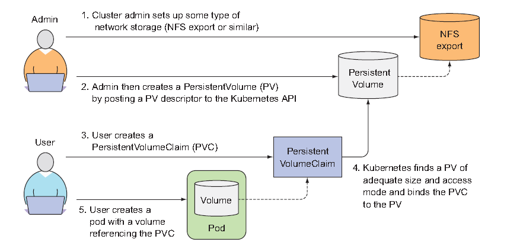

# Volumes: Attaching disk storage to containers
Every new container starts off with the exact set of files. Combine that with that fact that containers are ephemeral, you'll realize that the restarted container will not see anything that was written to the filesystem. You may not need the whole filesystem to be persisted, but you do want to perserve the directories that hold actual data.

## Introducing volumes
Kubernetes volumes are *a component of a pod* and are thus defined in the pod's specification<br><br>

Imagine you have the following containers:
- Webserver that serves HTML from /var/htdocs directory and stores log to /var/logs
- Agent process that creates HTML and store them in /var/html
- Log-processing container that takes logs from /var/logs directory.
Creating a pod with these three containers without them sharing disk storage doesn't make any sense. But if you somehow add two volumes to the pod and *mount* them at appropriate paths, you can create system that's much more than the sum of its parts.<br>
 <br><br>
By mounting the same volume into two containers, they can operate on the same files. Let me explain how:
- First, the pod has a volume called *publicHtml* mounted in the WebServer container at /var/htdocs
- The same volume is mounted in the ContentAgent container, but at /var/html
- Similarly, pod also has a volume called *logVol* mounted at /var/logs in both WebServer and LogRotator containers.
<br>

But be careful; it's not enough to define a volume in the pod - you need to:
- define a *VolumeMount* inside the container's spec. 
- use appropriate type, which is in this case *emptyDir*. Other types are:
    - hostPath
    - gitRepo
    - nfs
    - persistentVolumeClaim
A volume is bound to the lifecycle of a pod and will stay in existence only while the pod exists except for persistent one. 

## Using volumes to share data between containers
### emptyDir volume

Hands down, this is the simplest volume and is especially useful for sharing files between containers running in the same pod. But it can also be used by a single container for when a container needs to write data to disk temporarily such as when performing sort operation on a large dataset, which can't fit into the available memory.
Let's revisit the previous example where a web server, a content agent, and a log rotator share volumes, but this time just with one volume instead of two. You'll use Nginx as the web server and the UNIX fortune command to generate the HTML content.<br><br>

***fortuneloop.sh***
```bash
#!/bin/bash
trap "exit" SIGINT
mkdir /var/htdocs
while :
do
    echo $(date) Writing fortune to /var/htdocs/index.html
    /usr/games/fortune > /var/htdocs/index.html
    sleep 10
done
```
***Dockerfile for the above script***
```Dockerfile
FROM ubuntu:latest
RUN apt-get update; apt-get -y install fortune
WORKDIR /usr/app
ADD ./fortuneloop.sh ./fortuneloop.sh
RUN chmod +x fortuneloop.sh
ENTRYPOINT ["/usr/app/fortuneloop.sh"]
```
***Push the image to Registry***
```sh
docker build -t saka1023/fortune .
docker push saka1023/fortune
```
<br>

Now that you have two images required to run your pod, it's time to create the pod manifest.:
```yaml
apiVersion: v1
kind: Pod
metadata:
  name: fortune
spec:
  containers:
    - image: saka1023/fortune
      name: html-generator
      volumeMounts:
        - name: html
          mountPath: /var/htdocs            #The volume called html is mounted at /var/htdocs
    - image: nginx:alpine
      name: web-server
      volumeMounts:
        - name: html
          mountPath: /usr/share/nginx/html  #The same volume as above is mounted at /usr/share/nginx/html 
          readOnly: true                    #as read only
      ports:
        - containerPort: 80
          protocol: TCP
  volumes:                                  #A single emptyDir volume called html 
    - name: html
      emptyDir: {}
```
When the *html-generator* container starts, it starts writing the output of the *fortune* command to the /var/htdocs/index.html file every 10 seconds. As soon as the web-server container starts, it starts serving whatever HTML files are in the /usr/share/nginx/html directory(This is default directory). The end effect is a client sending an HTTP request to the pod on port 80 will receive the current fortune message as the response.<br><br>

*Seeing the pod in action*
```sh
#spin up the pod
kubectl apply -f "pod_descriptor.yaml"

#port-forward for simplicity
kubectl port-forward fortune 8080:80

#on different session, send a curl
curl http://localhost:8080
```
*emptyDir* you used was created on the actual disk. So its performance depends on the type of the node's disks. But you can tell K8S to create the *emptyDir*'s medium to Memory liek this:
```yaml
  volumes: 
    - name: html
      emptyDir:
        medium: Memory
```
An *emptyDir* is the simplest, but other types of volumes build upon it. 

### Using a Git repository as the starting point for a volume
A *gitRepo* volume is basically emptyDir volume that gets populated by cloning a Git repository and checking out a specific revision when the pod is starting up(but before its containers are created).<br>
 <br>
Note that after *gitRepo* volume is created, it's not kept in sync with the repo it's referencing. The files in the volume will not be updated when you push additional commmits to the Git repository. However, if pods are managed by controller, updating it will result in a new pod being created based on the new copy.<br>

*gitrepo-volume-pod.yaml*
```yaml
apiVersion: v1
kind: Pod
metadata:
  name: gitrepo-volume-pod
spec: 
  containers:
    - image: nginx:alpine
      name: web-server
      volumeMounts: 
        - name: html
          mountPath: /usr/share/nginx/html
          readOnly: true
      ports:
        - containerPort: 80
          protocol: TCP
  volumes:
    - name: html
      gitRepo:
        repository: "your_git_repo/migo-directory"
        revision: master    #The master branch will be checked out
        directory: .        #you want the repo to be cloned into the root dir of the volume
```
If you don't set the directory to '.',  the repository will clone into *migo-directory* subdirectory, which isn't what you want.<br>

#### Introducing sidecar containers
A sidecar container is a container that augments the operation of the main container of the pod. You basically add a sidecar to a pod so you can use an existing container image instead of cramming additional logic into the main app's code. To find an existing container image, which keeps a local directory synchronized with a Git repository, go to Docker Hub and search for ***"git sync"***<br>

#### Using a gitRepo volume with private Git repositories
There is one other reason for having to resort to Git sync sidecar containers; you can't use a *gitRepo* with a private Git repo. If you want to clone a private Git repo into your container, you should use a git-sync sidecar or a similar method instead of a *gitRepo* volume<br>

## Accessing files on the worker node's filesystem
Most pods should be oblivious of their host node, so they shouldn't access any files on the node's filesystem. But certain system-level pods do need to either read the node's files or use the node's filesystem. For this, you use *hostpath* volume. Technically, this is the first type of persistent storage we're introducing, because it's not tied to pod. If a pod is torn down and the next pod uses *hostPath* volume, they will see whatever was left behind the previoud pod, ***if and only if*** it's scheduled to the same node as the first one. Should you think of using *hostPath* volume for database's data directory, think again. 

### Examining system pods that use hostPath volumes
Intead of creating a new pod, let's see if any existing system-wide pods are already using this type of volume. 
```sh
kubectl get pods --namespace kube-system
NAME                               READY   STATUS    RESTARTS      AGE
kube-apiserver-minikube            1/1     Running   0             14d

#Let's pick the first one.
kubectl describe po kube-apiserver-minikube --namespace kube-system
...
...
Volumes:
  ca-certs:
    Type:          HostPath (bare host directory volume)
    Path:          /etc/ssl/certs
    HostPathType:  DirectoryOrCreate
```
The pod uses *hostPath* volumes to gain access to the node's /etc/ssl/certs. You'll see most use this type of volume either to access the node's log files, kubeconfig, or the CA certificates. Remember, you want to use *hostPath* only if you need to read or write system-files on the node. Never use them to persist data across pods.

<br>

## Using Persistent Storage
When an application running in a pod needs to persist data, it must be stored on type of network-attatched storage(NAS) because the data needs to be accessible from any cluster node.

### Using a GCE Persistent Disk in a pod volume
On Google Kubernetes Engine, you'll use a GCE Persistent Disk. Automatic provisiong is now possible though, let's start by provisioning the storage manually first. 

#### Creating a GCE Persistent Disk
You need to create it in the same zone as your Kubernetes cluster.<br>
```sh
$ gcloud container cluster list
NAME    ZONE            MASTER_VERSION  MASTER_IP 
kubia   europe-west1-b  1.2.5           104.155.84.137
```
This shows you've created your cluster in ***europe-west1-b***, so you need to create the GCE persistent disk in teh same zone as well.<br>

```sh
$ gcloud compute disks create --size=1GiB --zone=europe-west1-b mongodb

NAME        ZONE            SIZE_GB     TYPE STATUS
mongodb     europe-west1-b  1           pd-standard READY
```

#### Creating Minikube Persistent Volume and Persistent VolumeClaim
minikube supports PersistentVolumes of type hostPath out of the box. These PersistentVolumes are mapped to a directory inside the running minikube instance.<br>
minikube is configured to persist files stored under the following directories, which are made in the Minikube VM (or on your localhost if running on bare metal).<br> 
You may lose data from other directories on reboots.<br>

    /data*
    /var/lib/minikube
    /var/lib/docker
    /var/lib/containerd
    /var/lib/buildkit
    /var/lib/containers
    /tmp/hostpath_pv*
    /tmp/hostpath-provisioner*

*PersistentVolume-minikube.yaml*
```yaml
apiVersion: v1
kind: PersistentVolume
metadata:
  name: mongodb-volume
spec:
  accessModes:
    - ReadWriteOnce
  capacity:
    storage: 5Gi
  hostPath:
    path: /data/mongodb/
```

```yaml
apiVersion: v1
kind: PersistentVolumeClaim
metadata:
  name: mongodb-claim
spec:
  storageClassName: manual
  accessModes:
    - ReadWriteOnce
  resources:
    requests:
      storage: 3Gi
```


#### Creating a POD using a GCEPersistentDisk Volume
```yaml
apiVersion: v1
kind: Pod
metadata:
  name: mongodb
spec:
  containers:
    - image: mongo
      name: mongodb
      volumeMounts:
        - name: mongodb-data
          mountPath: /data/db #The path where MongoDB stores its data
      ports:
        - containerPort: 27017
          protocol: TCP
  volumes:
    - name: mongodb-data
      gcpPersistentDisk:
        pdName: mongodb #Persistent disk name
        fsType: ext4    #Filesystem type(linux file system)
```

#### Creating a POD using a Persistent storage of Minikube
```yaml

apiVersion: v1
kind: Pod
metadata:
  name: mongodb
spec:
  containers:
    - image: mongo
      name: mongodb
      volumeMounts:
        - name: mongodb-data
          mountPath: /data/db #The path where MongoDB stores its data
      ports:
        - containerPort: 27017
          protocol: TCP
  volumes:
    - name: mongodb-data
      persistentVolumeClaim:
        claimName: mongodb-claim
```

#### Writing data to the persistent storage by adding documents to your MongoDB
```sh
$ kubectl exec -it mongodb mongo

> use mystore
> db.foo.insert({name:"Migo"})
> db.foo.find()
```

#### Recreating the pod and verifying that it can read the data persisted by the previous POD
```sh
$ kubectl delete pod mongodb
$ kubectl apply -f mongodb-pod.yaml
$ kubectl exec -it mongodb mongo
> use mystore
> db.foo.find()
```
You should be able to see the data being still there. You're done with playing with the MongoDB pod, so you can delete it. However, hold off on deleting the ***underlying persistent disk*** you will use it again later. 

## Decoupling pods from the underlying storage technology
Infrastructure-related dealings should be the sole domain of the cluster administrator as a developer who deploy their apps on Kubernetes should never have to know what kind of storage technology is used underneath. 

### Introducing Persistent Volumes and PersistentVolumeClaims
 
<br>
<br>

With the figure, you can see instead of the developer adding a technology-specific volume to their pod, it's the cluster administrator who sets up the underlying storage and then registers it in K8s by creating ***PersistentVolume***.<br><br>

When a cluster user(developer) needs Persistent Storage, they create ***PersistentVolumeClaim*** manifest, specifying the minimum size and the access mode they require. 

### Creating a PersistentVolume
*mongodb-pv-hostpath.yaml*
```yaml
apiVersion: v1
kind: PersistentVolume
metadata:
  name: mongodb-pv
spec:
  capacity: 
    storage: 1Gi
  accessModes:
    - ReadWriteOnce
    - ReadOnlyMany
  persistentVolumeReclaimPolicy: Retain
  hostPath:
    path: /tmp/mongodb
```

After you create the PV, it should be ready to be claimed. See if it is ready by listing all PVs:
```sh
$ kubectl get pv
NAME        CAPACITY    RECLAIMPOLICY   ACCESSMODES   STATUS 
mongodb-pv  1Gi         Retain          RWO,ROX       Available
```
As you cann see, PV is shown "Available" because you haven't yet created PersistentVolumeClaim. Note that **PersistentVolumes don't belong to any namespace whereas PersistentVolumeClaims do belong to a namespace.** <br>

### Claiming a PV by creating a PVC
Claiming a PV is a completely separate process from creating a pod, because you want the same PersistentVolumeClaim to stay available even if the pod is rescheduled. 

#### Creating a PVC
```yaml
apiVersion: v1
kind: PersistentVolumeClaim
metadata:
  name: mongodb-claim  #Name of your claim you need this later
spec:
  resources:
    requests:
      storage: 1Gi
  accessModes:
    - ReadWriteOnce #You want the storage to support a single client
  storageClassName: "" #For dynamic provisioning
```
As soon as you create the PVC, K8s finds the appropriate PV and binds it to the PVC. The PV's capacity must be large enough to accommodate what the claim requests.<br>

#### Listing PVCs
```sh
$ kubectl get pvc
NAME        STATUS  VOLUME      CAPACITY    ACCESSMODES AGE
mongodb-pvc Bound   mongodb-pv  1Gi         RWO,ROX     3s
```
The claim is shown as **Bound** to PV named **mongodb-pv**<br>
The abbreviations used for the access modes:
- RWO : ReadWriteOnce  - Only a single node can mount the volume
- ROX : ReadOnlyMany   - Mulitple nodes can mount the volume for reading
- RWX : ReadWriteMany  - Multiple nodes can mount the volume for both reading and writing
<br>
Note that RWO,ROX,RWX pertain to the number of nodes NOT number of pods. 

#### Listing PV
```sh
$ kubectl get pv
NAME        CAPACITY    ACCESSMODES     STATUS  CLAIM       
mongodb-pv  1Gi         RWO,ROX         Bound   default/mongodb-pvc 
```
Now it's bound to claim **default/mongodb-pvc**. 

### Using a PVC in a pod
To use PV inside a pod, you need to reference the PVC by name inside the pod's volume(Yes, **PVC** - Not PV directly).<br>

*mongodb-pod-pvc.yaml*
```yaml
apiVersion: v1
kind: Pod
metadata:
  name: mongodb 
spec:
  containers:
  - image: mongo
    name: mongodb
    volumeMounts:
    - name: mongodb-data
      mountPath: /data/db
    ports:
    - containerPort: 27017
      protocol: TCP
  volumes:
  - name: mongodb-data
    persistentVolumeClaim: #Referenceing the PVC by name in the pod volume
      claimName: mongodb-claim
```
Creating the pod, check to see if the pod is indeed the same PV. You should see the data you stored earlier by running MongoDB shell again.

### Recycling PersistentVolumes
Before you wrap up this section, Let's do one last quick experiment. Delete the pod and the PVC:
```sh
kubectl delete pod mongodb
kutectl delete pvc mongodb-claim
```
<br>

What if you create the PVC again? Will it be bound to the PV or not? Let's recreate again and see how it goes. 
```sh
kubectl get pvc 

NAME        STATUS      VOLUME CAPACITY ACCESSMODES  AGE
mongodb-pvc Pending                                  13s
```
The claim's status is shown as **Pending**. Interesting. Maybe listing the PVs can shed more light on this:<br><br>

```sh
kubectl get pv
NAME        CAPACITY    ACCESSMODES     STATUS      CLAIM               AGE
mongodb-pv  1Gi         RWO,ROX         Released    default/mongodb-pvc 5m
```
The **STATUS** column shows the PersistentVolume as **Released**, not **Available** like before.<br><br>

Because you've already used the volume, it may contain data and shouldn't be bound to a completely new claim without giving the cluster admin a chance to clean it up.<br><br>

Without this, a new pod using the same PersistentVolume could read the data stored there by previous pod, even if the claim and pod were created in a different namespace.

#### Reclaiming PersistentVolumes Manually
You told K8s you wanted your PersistentVolume to behave like this when you created - by setting its **persistentVolumeReclaimPolicy: Retain**. The only way to manually recycle the PV to make it available again is to **delete and recreate** the PersistentVolume resource.

#### Reclaiming PersistentVolumes Automatically
Two other possible reclaim policies are **Recycle** and **Delete(default)**.<br>
The first one deletes the volume's contents and makes the volume available to be claimed again.<br>
The **Delete** policy deletes the underlying storage.<br><br>

TIP: You can change the PV's reclaim policy on an existing PV. For example, if it's initially set to Delete, you can easily change it to Retain to prevent losing valuable data. 

## Dynamic Provisioning of PersistentVolumes
From developer side, all they need to do is claim storage through PVC. But for admins, provisioning PV up front is not an easy job. Luckily, K8s can also perform this job automatically through ***dynamic provisioning of PVs***.
<br><br>

The cluster admin can deploy a ***Persistent Volume Provisioner*** and define one or more ***StorageClass*** to let users choose what type of PV they want. 
The users can simply refer to the StorageClass in their PVC. Note that similar to PersistentVolumes, StorageClass resources are not namespaced.
<br><br>

Most popular cloud providers include provisioners. But if Kubenetes is deployed on-premises, a custom provisioner needs to be deployed.<br><br>

Instead of the administrator pre-provisioning a bunch of PersistentVolumes, they need to define one or two (or more) StorageClasses and let the system create a new PersistentVolume each time one is requested through a PersistentVolumeClaim. The great thing about this is that it’s impossible to run out of PersistentVolumes (obviously, you can run out of storage space).<br><br>

### Defining the available storage types through StorageClass resources
Let's create one or more StorageClass resources
```yaml
apiVersion: storage.k8s.io/v1
kind: StorageClass
metadata:
  name: fast
provisioner: k8s.io/minikube-hostpath #The volume plugin to use for provisioning the PersistentVolume
parameters:
  type: pd-ssd #parameters passed to the provisioner
```
The StroageClass resource specifies which provisioner should be used for provisioning the PV when PVC requests this StorageClass. The parameters are passed to provisioner and are specific to each provisioner plugin.

### Requesting the storage class in PVC
After the StorageClass resource is created, users can refer to the storageclass by name.

#### Creating A PVC definition requesting a specific StorageClass
```yaml
apiVersion: v1
kind: PersistentVolumeClaim
metadata:
  name: mongodb-pvc
spec:
  storageClassName: fast #This PVC requests the custom storage class
  resources:
    requests:
      storage: 100Mi
  accessModes:
    - ReadWriteOnce
```
If you reference a non-existing storage class in a PVC, the provisioning of the PV will fail. 

#### Examining the created PVC and the dynamically provisioned PV
```sh
$ kubectl get pvc mongodb-pvc
NAME        STATUS      VOLUME          CAPACITY    ACCESSMODES     STORAGECLASS
mongodb-pvc Bound       pvc-1e6bc048    1Gi         RWO             fast

$ kubectl get pv
NAME            CAPACITY    ACCESSMODES     RECLAIMPOLICY   STATUS  STORAGECLASS
pvc-1e6bc048    1Gi         RWO             Delete          Bound   fast
```

### Dynamic provisioning without specifying a storage class
Attaching persistent storage to pods has become ever simpler. We'll look at the latest and simplest way of attaching a PV to pod.

#### Examining the default storage class 
kubectl get sc standard -o yaml
```yaml
apiVersion: storage.k8s.io/v1
kind: StorageClass
metadata:
  annotations:
    storageclass.beta.kubernetes.io/is-default-class: "true" #This annotation marks the storage as default
  creationTimestamp: 2022-03-01T15:24:11Z
  labels:
    addonmanager.kubernetes.io/mode: EnsureExists
    kubernetes.io/cluster-service: "true"
  name: standard
  resourceVersion: "180"
  selfLink: /apis/storage.k8s.io/v1/storageclassesstandard
  uid: b6498511-3a4b-11e7-ba2c-42010a840014
parameters:
  type: pd-standard
provisioner: kubernetes.io/gce-pd
```
Here we can see, default storage class is what's used to dynamically provision a PV<br>
if the PVC doesn't explicitly say which storage class to use. 

#### creating a PersistentVolumeClaim without specifying a storage class
You can create a PVC without specifying the **storageClassName** attribute.
```yaml
apiVersion: v1
kind: PersistentVolumeClaim
metadata:
  name: mongodb-pvc2
spec:
  resources:
    requests:
      storage: 100Mi
  accessModes:
    - ReadWriteOnce
```
This PVC definition includes only the storage size request and the desired access modes, but no storage class.<br>

```ssh
kubectl get pvc mongodb-pvc2

NAME            STATUS  VOLUME          CAPACITY    ACCESSMODES STORAGECLASS
mongodb-pvc2    Bound   pvc-95a5ec12    1Gi         RWO         standard
```

#### Forcing a PersistentVolumeClaim to be bount to one of the PRE-PROVISIONED PV
This finally brings us to why we set **storageClassName** to an empty string previously.<br>
Let me repeat the relevant lines:
```yaml
kind: PersistentVolumeClaim
spec:
  storageClassName: "" #Specifying an empty string as the storage class name 
                       # ensures the PVC binds to a pre-provisioned PV instaed of dynamic one
```
If you hadn'tt set the **storageClassName** attribute to an empty string, the dynamic volume provisioner would have provisioned a new PV, despite there being an appropriate pre-provisioned PV. 

#### Understanding the complete picture of dynamic PersistentVolume Provisioning
To summarize, the best way to attach persistent storage to a pod is to only create PVC and the pod.<br>
Everything else is taken care of by dynamic PersistentVolume Provisioner.<br>

