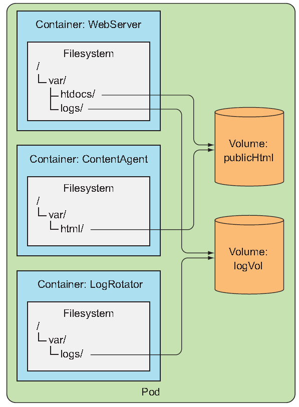

# Volumes: Attaching disk storage to containers
Every new container starts off with the exact set of files. Combine that with that fact that containers are ephemeral, you'll realize that the restarted container will not see anything that was written to the filesystem. You may not need the whole filesystem to be persisted, but you do want to perserve the directories that hold actual data.

## Introducing volumes
Kubernetes volumes are *a component of a pod* and are thus defined in the pod's specification  

Imagine you have the following containers:
- Webserver that serves HTML from /var/htdocs directory and stores log to /var/logs
- Agent process that creates HTML and store them in /var/html
- Log-processing container that takes logs from /var/logs directory.
Creating a pod with these three containers without them sharing disk storage doesn't make any sense. But if you somehow add two volumes to the pod and *mount* them at appropriate paths, you can create system that's much more than the sum of its parts. 
   
By mounting the same volume into two containers, they can operate on the same files. Let me explain how:
- First, the pod has a volume called *publicHtml* mounted in the WebServer container at /var/htdocs
- The same volume is mounted in the ContentAgent container, but at /var/html
- Similarly, pod also has a volume called *logVol* mounted at /var/logs in both WebServer and LogRotator containers.
 

But be careful; it's not enough to define a volume in the pod - you need to:
- define a *VolumeMount* inside the container's spec. 
- use appropriate type, which is in this case *emptyDir*. Other types are:
    - hostPath
    - gitRepo
    - nfs
    - persistentVolumeClaim
A volume is bound to the lifecycle of a pod and will stay in existence only while the pod exists except for persistent one. 