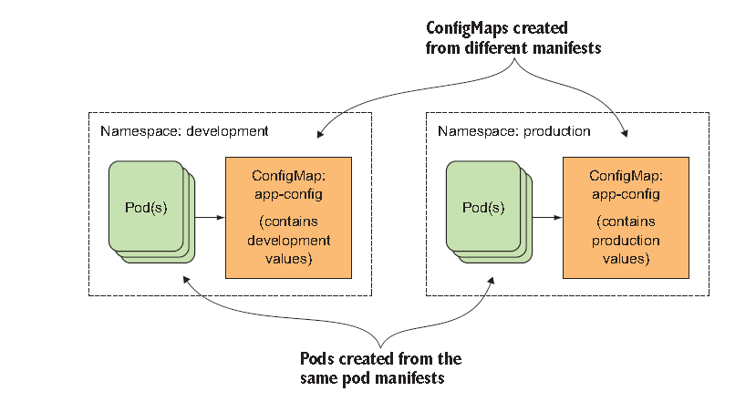
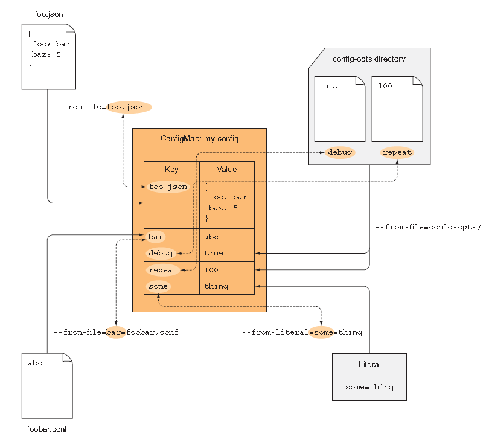
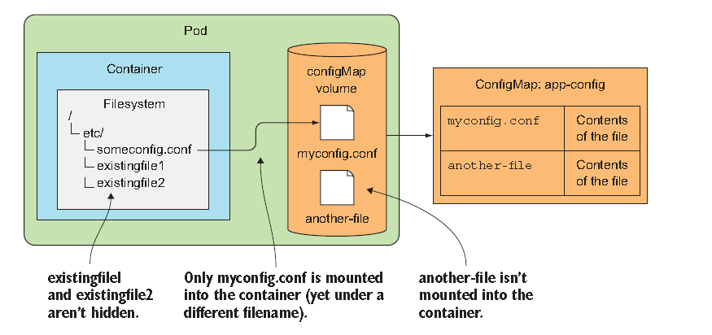
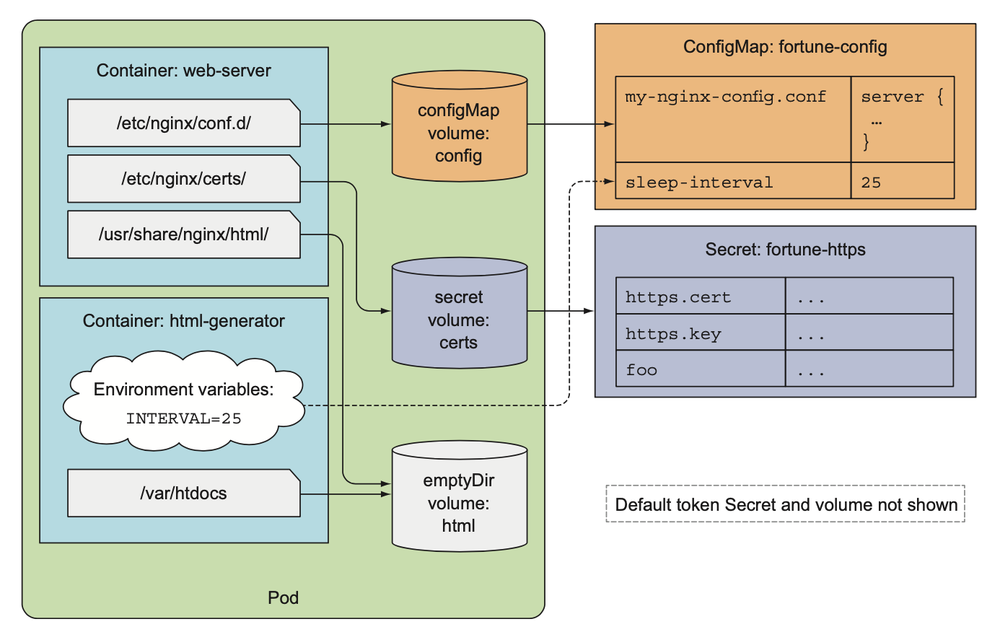

# ConfigMaps and Secrets: Configuring applications

Because almost all apps require configuration, which shouldn't be baked into the build app itself, let's see how to pass configuration options.

## Configuring containerized applications
- Command-line argument
- Setting custom environment variables for each container
    - for example, official MySQL container image uses an environment variable called **MYSQL_ROOT_PASSWORD**
- Mounting configuration files into containers through a special type of volume

Among them, using environment variable is a popular choice because you don't have to rebuild the image every time you  want to change the config.
Plus, as everyone with access to the image can see the config, it may cause some security issue unless otherwise taken care of.<br><br>

Kubernetes resource for storing configuration data is called a ConfigMap. Although most configuration options don't contain any sensitive information,
several can such as private encription keys, credentials. For that, Kubernetes offers another type of first-class object called a **Secret**.<br>


## Passing command-line arguments to containers 

### Defining the command and arguments in Docker
The whole commonad that gets executed in the container is composed of two parts: the ***command*** and the ***arguments***.

#### Understanding ENTRYPOINT and CMD
- **ENTRYPOINT** defines the executable invoked when the container is started.
- **CMD** specifies the arguments that get passed to the **ENTRYPOINT**
    - But you can still use the CMD to specify the command you want to execute. 

#### Understanding the difference between **SHELL** and **EXEC** forms
- shell form : for example, ENTRYPOINT node app.js
- exec form : for example, ENTRYPOINT ["node", "app.js"]

The difference is whether the specified command is invoked inside a shell or not. While **exec** form runs the process directly, shell form runs shell process first and the process of your interest will be started from that shell process which is unnecessary.

#### Making the internal configurable in your fotune image
Let's modify your fortune script and image so the delay interval in the loop is configurable. You'll add an **INTERVAL** variable and initialize it with the value of the first command-line argument. <br>

***fortuneloop.sh***:
```sh
#!/bin/bash
trap "exit" SIGINT
INTERVAL=$1
echo Configured to generate new fortune every $INTERVAL seconds
mkdir -p /var/htdocs
while : 
do 
    echo $(date) Writing fortune to /var/htdocs/index.html
    /usr/games/fortune > /var/htdocs/index.html
    sleep $INTERVAL
done
```
<br>

**Dockerfile**
```Dockerfile
FROM ubuntu:latest
RUN apt-get update ; apt-get -y install fortune
ADD fortuneloop.sh /bin/fortuneloop.sh
RUN chmod +x /bin/fortuneloop.sh
ENTRYPOINT ["/bin/fortuneloop.sh"]
CMD ["10"]  #default argument `
```
<br>

Let's push the image.
```sh
docker build -t saka1023/fortune:args .
docker push saka1023/fortune:args

#test it
docker run -it saka1023/fortune:args

docker run -it saka1023/fortune:args 15 #pass in command-line argument that will overwrite CMD argument
```

### Overriding the command and arguments in Kubernetes
You can choose to override not only **CMD** but also **ENTRYPOINT** in Kubernetes.<br> 
To do that, you set the properties *command* and *args* in the container specification.<br>

```yaml
apiVersion: v1
kind: Pod
metadata:
  name: migo-pod
spec:
  containers:
    - image: some/image
      command: ["/bin/command"] #exec form
      args: ["arg1","arg2","arg3"]
```
But also note that command and args fields can't be updated after the pod is created.

#### Running the fortune pod with a custom interval
fortune-pod-args.yaml
```yaml
apiVersion: v1
kind: Pod
metadata:
  name: fortune2s
spec:
  containers:
    - image: saka1023/fortune:args
      args: ["2"]
      name: html-generator
      volumeMouns:
        - name: html
          mountPath: /var/htdocs
```
If you have several arguments, you can also use different notation like 

    args:
      - foo
      - bar
      - "15"

While you don't need to enclose string values in question marks but you must enclose numbers(which makes it look more of strings, paradoxically)

## Setting Environemnt variables for a container
K8s allows you to specify a custom list of environment variables for each container of a pod. Although it would be useful to also define environment variables at the pod level, **no such option currently exsists.** Note that list of environment variables also cannot be updated after the pod is created.

#### Making the interval in your fortune image configurable through an environment variable
fortuneloop.sh:
```sh
#!/bin/bash
trap "exit" SIGINT
#INTERVAL=$1 Comment this out 
echo Configured to generate new fortune every $INTERVAL seconds
mkdir -p /var/htdocs
while : 
do 
    echo $(date) Writing fortune to /var/htdocs/index.html
    /usr/games/fortune > /var/htdocs/index.html
    sleep $INTERVAL
done
#----------------

docker build -t saka1023/fortune:env .
docker push saka1023/fortune:env
```

If the app was written in Java, you'd use **System.getenv("INTERVAL")**, whereas in Node.JS, you'd use **process.env.INTERVAL** and in Python you'd use **os.getenv("INTERVAL")**.

### Specifying environment variables in a container definition
fortune-pod-env.yaml:
```yaml
apiVersion: v1
kind: Pod
metadata:
  name: env-prac
spec:
  containers:
    - image: saka1023/fortune:env
      env: 
        - name: INTERVAL
          value: "30"
      name: html-generator
```

### Referring to other environment variables in a variable's value
You can also reference previously defined environment variables by using the **$(VAR)** syntax.
```yaml
      env:
        - name: FIRST_VAR
          value: "foo"
        - name: SECOND_VAR
          value: "$(FIRST_VAR)bar"
```
In this case, the SECOND_VAR's value will be "foobar".

### Understanding the drawback of hardcoding environment variables
Having values effectively hardcoded in the pod definition means you need to have separate pod definitions for your production and your development pods. 
To reuse one pod in multiple environments, it makes sense to decouple the configuration from the pod descriptor. you can do that by using:
- ***ConfigMap*** resource
- ***valueFrom*** (instead of value as in environmental variable)

## Decoupling configuration with a ConfigMap
If you think of a pod descriptor as source code for your app, it's clear you should move the configuration out of the pod description.

### Introducing ConfigMap
ConfigMap is a map containing key/value pairs with the values ranging from short literals to full config files.<br><br>

An application doesn't need to read the ConfigMap or even know if it exists.<br>
The contents of the map are passed to containers as either **environment variables** or as **files in a volume**.<br>
And just as environment varialbes can be referenced in command-pline argument using $(ENV_VAR) syntax, you can also<br>
pass ConfigMap entries to process as command-line arguments.<br><br>

Regardless of how an app consumes a ConfigMap, having the config in a separate standalone object allows you to keep multiple manifests for ConfigMap with the same name, each for different environment(DEV, QA, STG, PROD).<br>

<br>

### Creating a ConfigMap
To start with the simplest example, you'll first create a map with a single key and use it to fill the INTERVAL environment variable.<br>
There are two ways of doing it:
- kubectl create configmap
- posting a YAML 
<br>

```sh
kubectl create configmap fortune-config --from-literal=sleep-interval=25 #two equal signs!

#Keys must be valid DNS subdomain(only alphanumerics, dashes, underscored, dots)
```
This create a ConfigMap called "fortune-config" with the single entry "sleep-interval=25"<br><br>

To create ConfigMaps with multiple literal entries, you add multiple --from-literal arguments.<br>
```sh
kubectl create configmap migoconfig --from-literal=I=my --from-literal=me=mine
```
<br>

You can also inspect the YAML descriptor of the ConfigMap you just created by using kubectl get command. 
```sh
kubectl get configmap fortune-config -o yaml

apiVersion: v1
data: 
  sleep-interval: "25"
kind: ConfigMap
metadata:
  name: fortune-config
  namespace: default
...
```
As nothing seems extraordinary, you would have been able to easily write this YAML yourself.

#### Creating a ConfigMap entry from the contents of a file
ConfigMaps  can also store coarse-grained config data, such as complete files.<br>
To do this, "kubectl create configmap" command also supports reading "files" from disk<br>
and storing them as individual entries in the ConfigMap:
```sh
kubectl create configmap my-config --from-file=config-file.conf
```
<br>

When you run the previous command, kubectl looks for the file *config-file.conf* in the directory you run kubectl in.
It will then store the contents of the file under the key config-file.conf(the same as source file name). 
However, you can also specify a key manually like this:
```sh
kubectl create configmap my-config --from-file=customkey=config-file.conf
```
In this case, "customkey" became a key. <br>

#### Creating a ConfigMap from files in a directory
You can even import all files from a file directory:
```sh
kubectl create configmap my-config --from-file=/path/to/dir
```
In this case, kubectl will create an individual map entry for each file in the specified directory. 

#### Combining all of them
```sh
kubectl create configmap my-config \
  --from-file=foo.json              # Single file
  --from-file=bar=foobar.conf       # A file stored under custom key
  --from-file=config-opts/          # A whole directory
  --from-literal=some=thing         # literal value
```
<br>

<br>

### Passing a ConfigMap entry to a container as an environment variable
Now we've learned how you load literals or files through ConfigMap resource.<br>
But then, how do you get the values from this map and put them into pod's container?<br>
Again, the simplest one is environment variable:

```yaml
apiVersion: v1
kind: Pod
metadata:
  name: fortune-env-from-configmap
spec:
  containers:
    - image: saka1023/fortune:env
      env: 
        - name: INTERVAL
          valueFrom:                #Not value 
            configMapKeyRef:
              name: fortune-config  #Name of configMap you're referencing
              key: sleep-interval   
```
<br>

When the process running in the html-generator container reads the INTERVAL environment variable,<br>
it will see the value 25. 

#### Referencing Non-existing ConfigMaps in a Pod
What would happen if the referenced ConfigMap doesn't exist?<br>
The container referencing the non-existing ConfigMap will fail to start, but the other container will start normally.<br>
If you then create the missing ConfigMap, the failed container is started without requiring you to recreate the Pod.<br>
You can also mark a reference to a ConfigMap as optional(***configMapKeyRef.optional: true***)

### Passing all entries of ConfigMap as Environment variables at once
```yaml
apiVersion: v1
kind: Pod
metadata:
  name: fortune-env-from-configmap
spec:
  containers:
    - image: saka1023/fortune:env
      envFrom:                    #Using envFrom instead of env
        - prefix: CONFIG_         #All env virables will be prefixed with CONFIG_. This is optional.
          configMapRef:           
            name: my-config-map   #Referencing the ConfigMap called my-config-map
```
Imagine in the ConfigMap there were two key FOO and BAR and FOO-BAR. The descriptor above will result in the two variables being present inside container as  CONFIG_FOO, CONFIG_BAR. But not CONFIG_FOO-BAR as FOO-BAR is not a vaild variable name as it contains dash. 
<br>
<br>


#### Distinguishing files
If you pass in multiple files from directory, how can you distinguish files and entries? Say for example, when it is yaml file or json.
```sh
mkdir -p /home/wmp-user/configure-pod-container/configmap/
cd /home/wmp-user/configure-pod-container/configmap/
wget https://kubernetes.io/examples/configmap/game.properties
wget https://kubernetes.io/examples/configmap/ui.properties

#Create the configmap
kubectl create configmap game-config --from-file=/home/wmp-user/configure-pod-container/configmap/
```

The output is similar to this:
```yaml

Name:         game-config
Namespace:    default
Labels:       <none>
Annotations:  <none>

Data
====
game.properties:
----
enemies=aliens
lives=3
enemies.cheat=true
enemies.cheat.level=noGoodRotten
secret.code.passphrase=UUDDLRLRBABAS
secret.code.allowed=true
secret.code.lives=30
ui.properties:
----
color.good=purple
color.bad=yellow
allow.textmode=true
how.nice.to.look=fairlyNice
```
The game.properties and ui.properties files in the configure-pod-container/configmap/ directory are represented in the data section of the ConfigMap.

```sh
kubectl get configmaps game-config -o yaml
```

```yaml
apiVersion: v1
kind: ConfigMap
metadata:
  creationTimestamp: 2016-02-18T18:52:05Z
  name: game-config
  namespace: default
  resourceVersion: "516"
  uid: b4952dc3-d670-11e5-8cd0-68f728db1985
data:
  game.properties: |
    enemies=aliens
    lives=3
    enemies.cheat=true
    enemies.cheat.level=noGoodRotten
    secret.code.passphrase=UUDDLRLRBABAS
    secret.code.allowed=true
    secret.code.lives=30    
  ui.properties: |
    color.good=purple
    color.bad=yellow
    allow.textmode=true
    how.nice.to.look=fairlyNice   
```

### Passing a ConfigMap entry as a command-line argument
How can we pass values from a ConfigMap as argument to the main process running in the container?<br>
The truth is you can't directly pass that in **pod.spec.containers.args** field, but you can:
- initialize an environment variable from the ConfigMap entry
- refer to the variable inside the arguments

```yaml
apiVersion: v1
kind: Pod
metadata: 
  name: fortune-args-from-configmap
spec:
  containers:
    - image: saka1023/fortune:args # Use the image that takes the INTERVAL from the first argument
      env:
      - name: INTERVAL
        valueFrom:
          configMapKeyRef:
            name: fortune-config
            key: sleep-interval
      args: ["$(INTERVAL)"]        # Referencing the env variable in the argument
```

### Using a configMap volume to expose ConfigMap entries as files
Passing configuration options as environment variables or command-line arguments is usually used for short variable values.
A ConfigMap can also contain the whole config files as you've seen. When exposing them to container, you can use a special volume called ***configMap*** volume.
<br>

#### Creating the ConfigMap
Instead of modifying your fortuneloop.sh script once again, you'll now try a different example.<br>
You will use a config file to configure the Nginx web server running inside the fortune pod's webserver container.<br>
Say you want your Nginx to compress responses it sends to the client: <br><br>

*my-nginx-config.conf*:
```javascript
server {
  listen        80;
  server_name   www.migo-example.com;
  gzip on;
  gzip_types text/plain application/xml;    //this enables gzip compression for plain text and xml files

  location / {
    root /usr/share/nginx/html;
    index index.html index.htm;
  }
}
```
Now delete your existing fortune-config(with which you created sleep-invertal=25) ConfigMap with **"kubectl delete config-map fortune-config"**, so you can replace it with the new one.
<br><br>

Create a new directory called **"configmap-files"** and store Nginx config we just created into **"configmap-files/my-nginx-config.conf"**.<br>
Plus, to make the ConfigMap also contain sleep-interval entry, add a plain text file aclled **sleep-interval** to the same directory and put 25 in it.<br>


<br>

Now, create ConfigMap from all the files in the directory:
```sh
#create configmap
kubectl create configmap fortune-config --from-file=configmap-files/

#check out the result
kubectl get configmap fortune-config -o yaml

```
```yaml
apiVersion: v1
data:
my-nginx-config.conf: |
  server {
    listen 80;
    server_name www.kubia-example.com;
    gzip on;
    gzip_types text/plain application/xml;
    location / {
      root /usr/share/nginx/html;
      index index.html index.htm;
      }
  }
sleep-interval: |
25
kind: ConfigMap

```

You will see pipeline character after the colon in the first line of each entries signals that literal multi-line value follows. 

#### Using the ConfigMap's Entries in a volume
Creating a volume populated with the contents of a ConfigMap is as easy as: 
- creating a volume that references the ConfigMap by name 
- mounting the volume in a container

Nginx here reads its config file from "/etc/nginx/nginx.conf", which you don't want to override.<br>
Luckily, the default config file automatically includes all .conf files in the **"/etc/nginx/conf.d"** subdirectory so you should add your config file in there.<br><br>

*fortune-pod-configmap-volume.yaml*:
```yaml
apiVersion: v1
kind: Pod
metadata:
  name: fortune-configmap-volume
spec:
  containers:
  - image: saka1023/fortune:env
    env:
    - name: INTERVAL
      valueFrom:
        configMapKeyRef:
          name: fortune-config
          key: sleep-interval
    name: html-generator
    volumeMounts:
    - name: html
      mountPath: /var/htdocs

  - image: nginx:alpine
    name: web-server
    volumeMounts:
    - name: html
      mountPath: /usr/share/nginx/html
      readOnly: true
    - name: config
      mountPath: /etc/nginx/conf.d     # You're mounting the configMap volume at this location
      readOnly: true
    - name: config
      mountPath: /tmp/whole-fortune-config-volume
      readOnly: true
    ports:
      - containerPort: 80
        name: http
        protocol: TCP
  volumes:
  - name: html
    emptyDir: {}
  - name: config
    configMap:                         # The volume refers to your fortune-config configmap 
      name: fortune-config
```

#### Verifying Nginx is using the mounted config file.
The webserver should now be configured to compress the responses it sends. You can verify this by enabling port-forwarding from localhost:8080 to the pod's port 80 and checking the server's response with curl:
```sh
kubectl port-forward fortune-configmap-volume 8080:80 &

curl -H "Accept-Encoding: gzip" -I localhost:8080
...
...
ETag: W/"57b5a197-37"
Content-Encoding: gzip   # This shows the reponse is compressed.
```

#### Examining the mounted configMap volume's contents
let’s look at what’s in the /etc/nginx/conf.d directory now:
```sh
kubectl exec fortune-config-volume -c web-server ls /etc/nginx/conf.d  #-c is to select a container
my-nginx-config.conf
sleep-interval
```

Both entries from the ConfigMap have been added as files to the directory. The sleep-interval entry is also included, although it has no business being there, because it’s only meant to be used by the fortuneloop container.<br><br>

You could create two different ConfigMaps, but somehow it feels wrong to use multiple ConfigMaps to configure containers of the same pod. After all, having containers in the same pod implies that the containers are closely related and should probably also be configured as a unit.<br><br>

#### Exposing certain configMap entries in the volume
You can populate a configMap volume with only part of the configMap's entries. Use the volume's items attribute:
```yaml
apiVersion: v1
kind: Pod
metadata:
  name: fortune-configmap-volume-with-items
spec:
  containers:
  - image: luksa/fortune:env
    name: html-generator
    volumeMounts:
    - name: html
      mountPath: /var/htdocs
  - image: nginx:alpine
    name: web-server
    volumeMounts:
    - name: html
      mountPath: /usr/share/nginx/html
      readOnly: true
    - name: config
      mountPath: /etc/nginx/conf.d/
      readOnly: true
    ports:
    - containerPort: 80
      protocol: TCP
  volumes:
  - name: html
    emptyDir: {}
  - name: config
    configMap:                        #Instead of ending with just configMap name, it extends to items and its key, path.
      name: fortune-config
      items:
      - key: my-nginx-config.conf     # You want the entry under this key included
        path: gzip.conf               # The entry's value should be stored in this file.
```
When specifying individual entries, you need to set the filename(path) for each individual entry, along with the entry's key. 

#### Understanding that mounting a directory hides existing files in that directory
There's one important thing to discuss at this point. You mounted the volume as a directory, which means you've hidden any files that are stored in the **/etc/nginx/conf.d** directory in the container image itself. This happens when you mount a filesystem into non-empty directory in Linux.<br><br>

Imagine mounting a volume to "/etc" directory. That would most likely break the whole container. Naturally, you're now wondering how to add individual files from a ConfigMap into an existing directory without hiding exisitng files stored in it. An additional **subpath** property on the **volumeMount** allows you to mount either a single file or a single directory from the volume instaed of mounting the whole volume.<br>


<br>

Let's see the pod descriptor using subPath:<br>
```yaml
spec:
  containers:
    - image: some/image
      volumeMounts:
        - name: myvolume
          mountPath: /etc/someconfig.conf     #You're mounting into a file, not a directory
          subPath: myconfig.conf              #Instead of mounting the whole volume, you're mounting only myconfig.conf entry
```


#### Deficiency in using subPath
As effective as it may sound, this method of mounting individual files has a relatively big deficiency related to updating files. What? really. Your file is not going to be updated if  you've mounted a single file in the container. 


#### Setting the File Permissions for files in a configMap Volume
By default, the permissions on all files in a configMap volume are set to 644(-rw-r-r--).<br>
You can change this by setting the defaultMode property in the volume spec, as shown in the following listing:
```yaml
apiVersion: v1
kind: Pod
metadata:
  name: fortune-configmap-volume
spec:
  containers:
  - image: saka1023/fortune:env
    env:
    - name: INTERVAL
      valueFrom:
        configMapKeyRef:
          name: fortune-config
          key: sleep-interval
    name: html-generator
    volumeMounts:
    - name: html
      mountPath: /var/htdocs

  - image: nginx:alpine
    name: web-server
    volumeMounts:
    - name: html
      mountPath: /usr/share/nginx/html
      readOnly: true
    - name: config
      mountPath: /etc/nginx/conf.d
      readOnly: true
    - name: config
      mountPath: /tmp/whole-fortune-config-volume
      readOnly: true
  volumes:
  - name: html
    emptyDir: {}
  - name: config
    configMap:
      name: fortune-config
      defaultMode: 6600   #This sets the permissions for all files to -rw-rw------
```

### Updating an app's config without having to restart the app
One of the drawbacks of using environment variables or command-line arguments as a configuration source is the inability to update them while the process is running. Using ConfigMap and exposing it through a volume brings the ability to update the configuration without having to recreate teh pod or even restart the container.<br><br>

When you update a ConfigMap, the files in all the volumes referencing it are updated. It's then ***up to the process to detect files have been changed and reload them***. Although Kubernetes supports sending a signal to the container after updating files and the files get updated, if the process doesn't support auto-reloading the config, it wouldn't work.

#### Editing a ConfigMap
Let's modify Nginx config file and make Nginx use the new config withoutt restarting the pod. Try switching gzip compression off by editing fortune-config ConfigMap with:
```sh
kubectl edit configmap fortune-config
```
```yaml
apiVersion: v1
data:
my-nginx-config.conf: |
  server {
    listen 80;
    server_name www.kubia-example.com;
    gzip off;         
    gzip_types text/plain application/xml;
    location / {
      root /usr/share/nginx/html;
      index index.html index.htm;
      }
  }
sleep-interval: |
25
kind: ConfigMap

```
<br>

Soon afterward, the actual file in the volume will be updated. You can confirm this by printing the contents of the file with **kubectl exec**:
```sh
kubectl exec fortune-configmap-volume -c web-server cat /etc/nginx/conf.d/my-nginx-config.conf
```

It make take a while for the files to get updated. Anyway, you'll find this has no effect on Nginx because Nginx doesn't watch the files and reload them automatically.
```sh
curl -H "Accept-Encoding: gzip" -I localhost:8080
...
...
ETag: W/"57b5a197-37"
Content-Encoding: gzip 
```

#### Signaling Nginx to reload the config
Nginx will continue to compress its responses until you tell it to reload its config files, which you can do with the following command:
```sh
kubectl exec fortune-configmap-volume -c web-server -- nginx -s reload
```

Now, if you try hitting the server again with curl, you should see the response is no longer compressed(it doesn't contain the Content-Encoding:gzip header)

#### Understanding how the files are updated atomically
You may wonder what will happen if an app can detect config file changes on its own and reload them before K8s has finished updating all the files in the configMap. Luckily, this doesn't happen because all the files are updated atomically. K8s achieves this by using symbolic links. If you list all the files in the mounted configMap volume, you'll see something like the following:
```sh
kubectl exec -it fortune-configmap-volume -c web-server -- ls -lA /etc/nginx/conf.d
drwxr-xr-x ... 12:15 ..4984_09_04_12_15_06.865837643
lrwxrwxrwx ... 12:15 ..data -> ..4984_09_04_12_15_06.865837643              
lrwxrwxrwx ... 12:15 my-nginx-config.conf -> ..data/my-nginx-config.conf
lrwxrwxrwx ... 12:15 sleep-interval -> ..data/sleep-interval
```
The files in the mounted configMap volume are symbolic links pointing to files in the **..data** dir.<br>
The **..data** dir is also a symbolic link pointing to a directory called ..4984_09_04_12_15_06.865837643<br>
Simply put, Kubenetes creates a new directory and write "all files" into it, and then re-links the ..data symbolic link to the new directory, effectively  changing all at once. 

#### Understanding that files mounted into existing directories don't get updated
As discussed previously, if you've mounted a single file in the container, the file will not be updated.<br>
One workaround is to mount the whole volume into a different directory and then create a symbolic link pointing to the file in question. The sym-link can be either created  in the container image itself, or you could create the symlink when the container starts.

#### Understanding the consequences of updating a ConfigMap
You don't want the containers to be different to each other as at the heart of container technology, there is immutability which make you feel certain that there is no difference.<br><br>

Main problem occurs when the app doesn't support reloading its configuration. This results in different running instances being configured differently.<br><br>

Therefore, if the app doesn't reload its config automatically, modifying an existing ConfigMap may not be a good idea. If the app does support reloading, modifying the ConfigMap usually isn't such a big deal, but you need to be aware that the files in individual pods may out of sync for up to a whole minute as files in the configMap volumes are not updated synchonously. 

## Using Secrets to pass sensitive data to containers
Config usually includes sensitive information, such as credentials and private encryption keys which need to be kept secure. 

### Introducing Secrets 
Secrets are a different type of object in K8s and it behaves much like ConfigMaps - they're also maps that hold key-value pairs. You can:
- pass Secret entries to the container as **environment variables**.
- expose Secret entries to files **in a volume**. 
<br>

Kubernetes keeps your Secret by making sure each Secret is only distributed to the nodes that run the pods that need access to the Secret. Plus, **Secret are always stored in memory on the nodes** and never written to physical storage.<br><br>

On top of that, from K8s version 1.7 etcd(in master node) stores Secret in encrypted form, making the system much more secure. Because of this, it's imperative you properly choose when to use a Secret or a ConfigMap. Criteria would be:
- Use a ConfigMap to store non-sensitive, plain configuration data. 
- Use a Secret to store any data that is sensitive in nature. 
- If a config file includes both sensitive and non-sensitive data, you should store them in a Secret. 

### Introducing the default token Secret
When using "kubectl describe" on a pod, the command's output always contains something like this:

  Volumes:
    default-token-cfee9:
      Type:       Secret(a volume populated by a Secret)
      SecretName: default-token-cfee9

Every pod has a **secret** volume attached to it automatically. Because Secrets are resources, you can list them with "kubectl get secrets" and find the default-token Secret in that list.<br><br>

And "kubectl describe pod" command will show you where the secret volume is mounted:

  Mounts:
    /var/run/secrets/kubernetes.io/serviceaccount from default-token-cfee9

Note that by default, the **default-token** Secret is mounted into every container, but you can disable that in each pod by setting **automountService-AccountToken** field in the spec to **false**.<br><br> 

We've said Secrets are like ConfigMaps, so if the Secret contains three entries, you can expect to see three files in the directory the **secret volume** is mounted into. Let's check that:
```sh
kubectl exec your_pod_name ls /var/run/secrets/kubernetes.io/serviceaccount/
```
You will see how your app can use these files to access the API server in the next chapter. 

### Creating a Secret
You'll improve your fortune-serving Nginx container by configuring it to also serve HTTPS traffic. For this, you need to create a certificate and a private key. First, generate the certificate and private key files:
```sh
#Create private key
$ openssl genrsa -out https.key 2048  #https.key -> name of the key

#Create csr(certificate signing request)
$ openssl req -new -x509 -key https.key -out https.cert -days 3650 -subj /CN=www.migo.com
#This command use your private key file(-key https.key) to create a new csr(-out https.cert) and
#disable question prompts by prodiving csr information(-subj)
```

Now to help better demonstrate a few things about Secrets, create an additional dummy file called foo and make it contain the string bar. 

```sh
$ echo bar > foo
```

Now you can use **"kubectl create secret"** to create a Secret from the tree files:
```sh
$ kubectl create secret generic fortune-https --from-file=https.key --from-file=https.cert --from-file=foo
secret "fortune-https" created
```
In this case, you're creating a generic Secret called **fortune-https** and including https.key and https.cert. As you learned earlier, you could also include the whole directory with **"--from-file=fortune-https"** instead of specifying each file individually.

### Comparing ConfigMaps and Secrets 
They have a pretty big difference. In fact, this is what drove developers to create ConfigMaps after Kubernetes had already supported Secrets for a while. See the following:<br>
*kubectl get secret fortune-https -o yaml"*:
```yaml
apiVersion: v1
data:
  foo: YmFyCg==
  https.cert: LS0tLS1CRUdJTiBDRVJUSUZJQ0FURS0tLS0tCk1JSURCekNDQ...
  https.key: LS0tLS1CRUdJTiBSU0EgUFJJVkFURSBLRVktLS0tLQpNSUlFcE...
kind: Secret
...
```
<br>

Now, compare this to the YAML of the ConfigMap you created earlier:<br>
*kubectl get configmap fortune-config -o yaml*:
```yaml
apiVersion: v1
data:
  my-nginx-config.conf: |
    server {
    ... 
    }
  sleep-interval: |
    25
kind: ConfigMap
...
```
Notice the difference? The **contents of a Secret's entries are shown as Base64-encoded strings, whereas those of a ConfigMap are shown in clear text.**<br><br>

#### Using Secrets For Binary Data
The reason for using Base64 encoding is sipmle. A Secret's entries can contain binary values, not only plain-text. Base64 encoding allows you to include the binary data in YAML or JSON, which are both plain-text formats. Bear in mind that you can use Secret even for non-sensitive binary data, but be aware that **the maximum size of Secret is limited to 1MB**.

#### Introducing stringData Field
Because not all sensitive data is in binary form, K8s also allows setting a Secret's value through the ***stringData*** field: 

```yaml
apiVersion: v1
kind: Secret
stringData: #The stringData field can be used for non-binary Secret data.
  foo: plain text
data:
  https.cert: Ls0 ....
  https.key: LS0tLs....
```
The stringData field is **write-only**(not read only). It can only be used to set values. When you retrieve the YAML through "-o yaml", the stringData field will not be shown. Instead, that will be shown under **data** field and will be Base64-encoded. <br>

#### Reading A Secret's Entry in a Pod
When you expose the Secret to a container through a secret volume, **the value of the Secret entry is decoded** and written to the file in its actual form. The same is also true when exposing the Secret entry through an environment variable. <br><br>

  Q. They said they store Secret on memory. But then if Secret entry is decoded and written to the file, doesn't it contradict what it said? 

### Using the Secret in a Pod
Now, we have fortune-https Secret that contains both cert and key files. All you nedd to do now is configure Nginx to use them. 

#### Modifying the fortune-config configMap to enable HTTPS
*kubectl edit configmap fortune-config*
```yaml
...
data:
  my-nginx-config.conf: |
    server {
      listen                80;
      listen                443 ssl;
      server_name           www.migo.com;
      ssl_certificate       certs/https.cert;
      ssl_certificate_key   certs/https.key;
      ssl_protocols         TLSv1 TLSv1.1 TLSv1.2;
      ssl_ciphers           HIGH: !aNULL: !MD5;

      location  / {
        root    /usr/share/nginx/html;
        index   index.html index.htm;
      }
    }
  sleep-interval: |
    25
...
```
This configures the server to read the certificate and key files from /etc/nginx/certs, so you'll need to mount the secret volume there. 

#### Mounting The fortune-https Secret into a Pod
You'll create a new fortune-https pod and mount the secret volume holding the certificate and key into the proper location in the web-server container.<br>
*fortune-pod-https.yaml*:
```yaml
apiVersion: v1
kind: Pod
metadata:
  name: fortune-https
spec:
  containers:
    - image: saka1023/fortune:env
      name: html-generator
      env:
        - name: INTERVAL
          valueFrom:
            configMapKeyRed:
              name: fortune-config
              key: sleep-interval
      volumeMounts:
        - name: html
          mountPath: /var/htdocs
    
    - image: nginx:alpine
      name: web-server
      volumeMounts:
        - name: html
          mountPath: /usr/share/nginx/html
          readOnly: true
        - name: config
          mountPath: /etc/nginx/conf.d
          readOnly: true
        - name: certs                  #Configure Nginx to read the cert and key from 
          mountPath: /etc/nginx/certs/ # this path
          readOnly: true
      ports:
        - containerPort: 80
          containerPort: 443
  volumes:
    - name: html
      emptyDir: {}
    - name: config
      configMap:
        name: fortune-config
        items:  #Only certain file 
          - key: my-nginx-config.conf ## You want the entry under this key included
            path: https.conf          # But it would be stored under this name
    - name: certs
      secret:
        secretName: fortune-https
```
The following figure shows he components defined in the YAML. <br>



<br>

Note that just like configMap volumes, secret volumes also support specifying file permissions for the file exposed in the volume through defaultMode property.<br>

#### Testing whether Nginx is using the cert and key from the Secret 
```sh
kubectl port-forward fortune-https 8443:443 &

curl https://localhost:8443 -k (-v)
```

#### Understanding Secret volumes are stored in memory
The secret volume uses an in-memory filesystem(tmpfs) for the Secret files. You can see this if you list mounts in the container:
```sh
kubectl exec fortune-https -c web-server -- mount | grep certs
tmpfs on /etc/nginx/certs type tmpfs (ro,relatime)
```
<br>

Because tmpfs is used, the sensitive data stored in the Secret is never written to disk. 

#### Exposing A Secret's entries through environment variables
Instaed of using volumes, you could also have exposed individual entries from the secret as environment variables. For example, if you wanted to expose "foo" key as "FOO_SECRET", you'd add the snippet from the following listing to the container definision:

```yaml
  env:
    - name: FOO_SECRET
      valueFrom:
        secretKeyRef:
          name: fortune-https #name of the secret holding the key
          key: foo            #key of the secret to expose
```

Even though k8s enables you to expose Secret through environment variable, it may not be the best idea to use this feature because applictions usually dump environment variables in error reports or even write them to the application log at startup, resulting in secret inadvertently being exposed. 

<br>

### Understanding Image pull secrets
Aside from passing Secrets to your application, sometimes Kubernetes itself requires you to pass credentials to it - for example, when you have to use images from a private container image registry. Not surprisingly this is also done throug Secrets.<br><br>

#### Using a private image repository on Docker Hub
You can mark a repository as private one by logging in at http://hub.docker.com and check a checkbox.<br>
To run a pod which uses an image from the private repository, you need to do two things:
- Create a Secret holding the credentials for the Dokcer registry.
- Reference that Secret in the imagePullSecrets field of the pod manifest 
<br>

#### Creating a Secret for Authenticating with a Docker Registry
Creating a Secret is not that different from creating generic secret except for the type you use:
```sh
$ kubectl create secret docker-registry mydockerhubsecret --docker-username=username --docker-password=password --docker-email=my_email@domain.com
```
<br>

If you inspect the contents of the Secret with "describe", you'll see it includes a single entry called **.dockercfg** that is equivalent to the .dockercfg file in your home directory, which is created when you run the docker login command.

#### Using the Docker-Registry Secret in a Pod definition
```yaml
apiVersion: v1
kind: Pod
metadata:
  name: private-pod
spec:
  imagePullSecrets:
    - name: mydockerhubsecret #This enables pulling images froma private image registry
  containers:
    - image: username/image:tag
      name: whatever
```

#### Not having to specify imagePullSecrets on every pod
You may wonder if you need to add the same "imagePullSecrets" on every pod definition. Luckily, that's not the case. You'll learn how image pull Secrets can be added to all your pods automatically in later chapter(ch.12) by using ServiceAccount.
