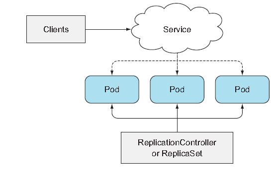
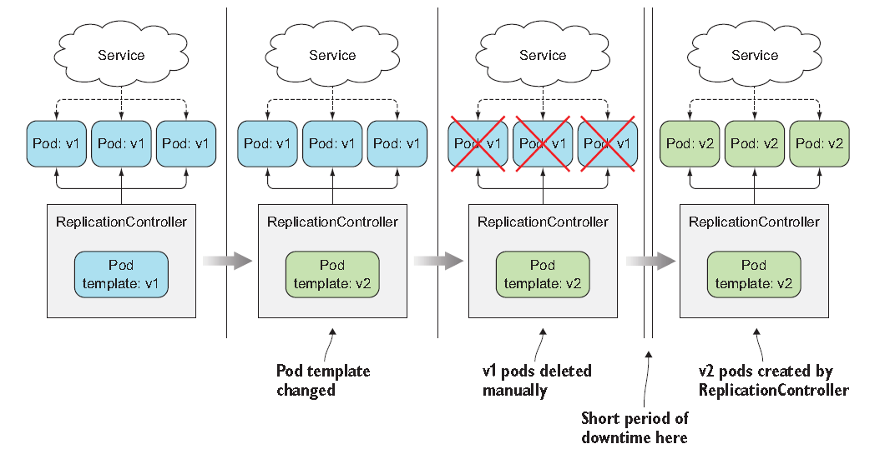
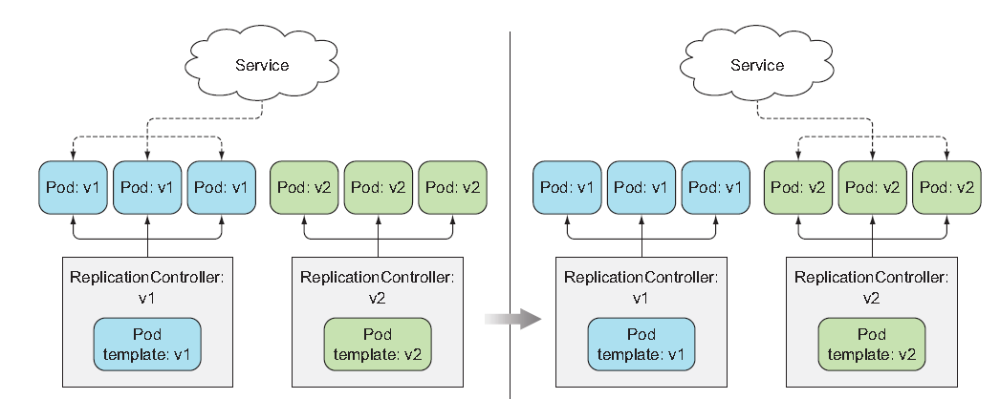
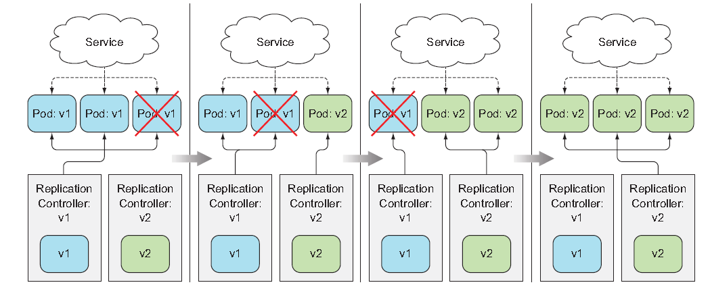
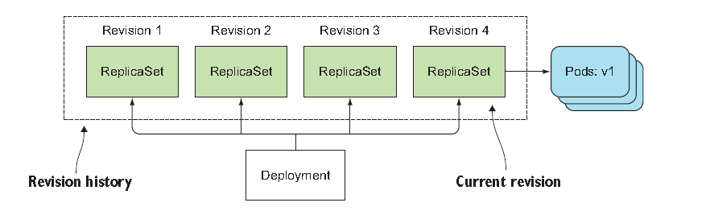
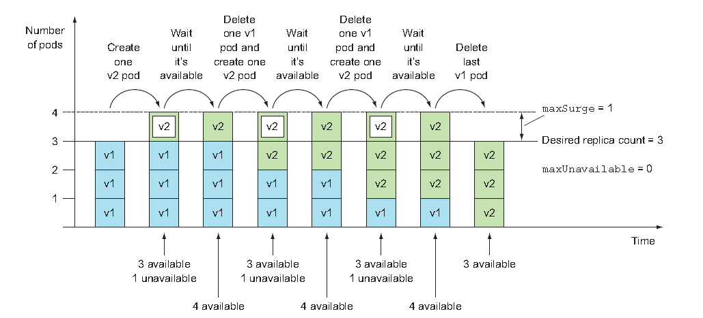
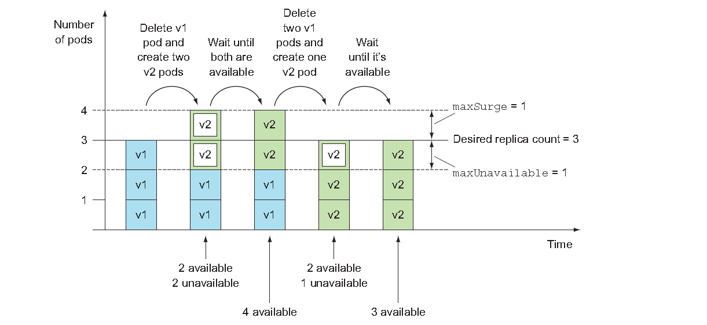

# Deployments: updating applications declaratively
Eventually, you're going to want to update your app. This chapter covers how to update apps running in a Kubernetes cluster and how Kubernetes helps you move toward a true zero-downtime update process. Deployments enable declarative application updates. 

## Updating applications running in pods
The following is how a basic application works in K8s.<br>
<br>

Initially, the pods run the first version(v1) of your application. And imagine now you developed a newer version tagged as v2.<br>
Because you can't change an existing pod's image after the pod is creted, you need to remove the old pods and replace them.<br>
For that, you have two ways:
- Delete all existing pods first and then start the new ones
- Start new ones and once they're up, delete the old ones. 
<br>

The first option will obviously lead to a short period of down-time. But at the same time, the second option requires your app<br>
to handle running two versions of the app, resulting in quite a lot of overhead.<br><br>

### Deleting old pods and replacing them with new ones
<br><br>

You can easiliy replace old one with new one by modifying the pod template so it refers to version *v2*.<br>
This is the easiest if you wan accept the short downtime.

### Spinning up new pods and then deleting the old ones
<br><br>

Pods are fronted by a Service. It's possible to have the Service front only the initial version.<br>
You first bring up the pods running the new version and then you can change the Service's label selector.<br>
This is called a ***blue-green deployment.***

    You can change a Service's pod selector with the "kubectl set selector"


### Rolling update using two ReplicationControllers(Deprecated completely)
<br><br>


### Running the app and exposing it through a service using a single YAML file
kubia-rc-and-service-v1.yaml
```yaml
apiVersion: v1
kind: ReplicationController
metadata:
  name: migo-v1
spec:
  replicas: 3
  templates:
    metadata:
      name: migo
      labels:
        app: migo
    spec:
      containers:
        - image: saka1023/node_app:v1
          name: migo-con
---
apiVersion: v1
kind: Service
metadata:
  name: migo
spec:
  type: LoadBalancer
  selector:
    app: migo
  ports:
    - port: 80
      targetPort: 8080
```
Go ahead and post the YAML to k8s. Note that if you use LoadBalancer in Minikube, use "minikube tunnel" command.<br>

Now you'll create version 2 of the app. For that, all you need to do is change the response to say, "This is v2".

```js
const http = require("http");
const os = require("os");
console.log("Kubia server starting...");

var handler = function(request,response){
    console.log("Received request from "+ request.connection.remoteAddress);
    response.writeHead(200);
    response.end("This is v2 running in pod "+ os.hostname() + "\n")
}

var www = http.createServer(handler);
www.listen(8080);
```

### Understanding why kubectl rolling-update is now obsolete
Most importantly, it's kubectl *client*, NOT *master* who performs all the update steps which causes a problem.<br><br>

Why is it such a bad thing? 
- What if you lost network connectivity while kubectl was performing the update?
  - Then the update process would be interrupted mid-way, resulting in Pods and ReplicationControllers being in intermediate state. 
- It is imperative as opposed to declarative
  - You never tell Kubernetes to add an additional pod or remove an excess one - you change the number of desired replicas and that's it. 
  - Similarly, you will want to change the image tag.

And these are what drove the introduction of a new resource called **Deployment.**


## Using Deployment for updating apps declaratively
When you create a Deployment, a ReplicaSet resource is created underneath so when using a Deployment, the actual pods are created and managed by the Deployment's ReplicaSets, NOT by Deployment directly.<br><br>

You want to use Deployment when you need to update app as without them ReplicationController should be added and coordinate at least two controllers to dance around each other without stepping on each other's toes -- which is error prone.<br><br>

Using a Deployment instaed makes things much easier. In fact, it's not the Deployment resource itself but the controller process running in the Kubernetes control plane who does the work though. 

### Creating a Deployment
Similar to Replication controller, it is composed of label selector, a desired replica count, and a pod template. Plus, it also contains a filed which specifies a deployment strategy in case of the update.<br><br>

**Creating a Deployment Manifest**:
```yaml
apiVersion: apps/v1
kind: Deployment
metadata:
  name: migo-deployment
spec:
  replicas: 3
  selector:       # required
    matchLabels:  # different from RC
      app: migo
  template: 
    metadata:
      name: migo-pod
      labels:
        app: migo
    spec:
      containers:
      - image: saka1023/node_app:v1
        name: migo-con
```

```sh
kubectl apply -f <deployment_manifest.yaml> --record
```
Be sure to include the --record command-line option when creating it. This records the command in the revision history, which will be useful later. 

#### Displaying the status of the deployment rollout
```sh
kubectl rollout status deployment migo-deployment

deployment "migo-deployment" successfully rolled out
```

#### Understanding how Deployments create ReplicaSets which then create the Pods
Take note of the names of the following pods:
```sh
kubectl get pods

NAME                               READY   STATUS    RESTARTS   AGE
migo-deployment-8694db8849-6vqf2   1/1     Running   0          3m39s
migo-deployment-8694db8849-p6gvm   1/1     Running   0          3m39s
migo-deployment-8694db8849-sfvrn   1/1     Running   0          3m39s
```

When you create pods through RC, their names were composed of the name of the RC plus a randomly generated string.<br>
And the three pods above created by Deployment include an additional numeric value in the middle.<br><br>

The number corresponds to the hashed value of the pod template in the Deployment and the ReplicaSet managing these Pods.<br>
So by now, you should be able to search for ReplicaSet behind it.<br>
```sh
kubectl get rs

NAME                         DESIRED   CURRENT   READY   AGE
migo-deployment-8694db8849   3         3         3       7m6s
```

And there you go, the name is matched to the name of the pods. As you will see later, a Deployment creates multiple ReplicaSets - one for each version of the pod.

### Updating a Deployment
To update pod controlled by Deployment, the only thing you need to do is modify the pod template defined in the Deployment resource and Kubernetes will take all the steps necessary to get the actual system state to what's defined in the resource. <br><br>
Simply put, just reference new image tag and leve it to K8s to transform your system.

#### Understanding the Available Deployment Strategies. 
- RollingUpdate ( default )
- Recreate ( delete all pods at once and then creates new ones. Recommened to use this when application doesn't support running multiple versions in parallels.)

#### Slowing down the rolling update for demo purpose
You can slow down the update process by setting: 

  minReadySeconds

attribute on the Deployment. With the following command, you can do it imperatively. 

  $ kubectl patch deployment deployment_name -p '{"spec":{"minReadySeconds":10}}'

This patch command doesn't cause any kind of update to the pods because it doesn't change the pod template. 

#### Triggering rolling update
Let's first run curl loop so we can track the update process;

  while true; do curl http://ip_of_service; done

Now, instead of editing the whole YAML file, you can use the following command;

  kubectl set image deployment deployment_name container_name=saka1023/node_app:v2

If you've run the curl loop, you'll see requests initially hitting only "v1" and more and more of t hem hit the "v2".

#### Understanding the awesomeness of deployments
Now, what happened is by chanding a single field, you've updated your app to a newer version.<br><br>

The controllers running as part of Kubernetes control plane then performed the update; the process wasn't performed by the kubectl client, like it was when you used kubectl rolling-update in old days.<br><br>

  Be aware that if the pod template in the Deployment references a ConfigMap(or a Secret), modifying the ConfigMap will not trigger an update. 

  One way to trigger an update when you need to modify an app's config is to create a "new" ConfigMap and modify the template so it referneces the new ConfigMap

When you get a list of ReplicaSet, you can still see the old ReplicaSet next to the new one. 
```sh
kubectl get rs

NAME                DESIRED     CURRENT       AGE
migo-1506449474     0           0             24m
migo-1581357123     3           3             23m
```
Why is this RepliaSet still here? It is for Version control. 

### Rolling back a Deployment
Now you are running v2 of your image. In version 3, you'll introduce a bug that makes your app handle only the first four requests properly. All requests from the fifth request onward will return an interal server error(code 500).<br>
app.js:
```js
const http = require("http");
const os = require("os");

var requestCount=0;
console.log("Kubia server starting...");

var handler = function(request,response){
    console.log("Received request from "+ request.connection.remoteAddress);
    if (++requestCount>=5){
      response.writeHead(500);
      response.end("Some internal error has occurred! This is pod " +
        os.hostname() + "\n");
      return;
    }
    response.writeHead(200);
    response.end("This is v2 running in pod "+ os.hostname() + "\n")
}

var www = http.createServer(handler);
www.listen(8080);
```

#### Deploying version 3
Create Dockerfile, package this and push it to Docker registry and execute the following command;

  kubectl set image deployment migo nodejs=saka1023/node_app:v3

You can follow the progress of the rollout with kubectl rollout status:
```sh
kubectl rollout status deployment migo
```

And after few requests, your web clients start receiving errors. 

  while true; do curl http://130.211.109.222; done
  This is v3 runing in pod migo-1914148340-lalmx
  This is v3 runing in pod migo-1914148340-bz35w
  This is v3 runing in pod migo-1914148340-w0voh
  ...
  This is v3 runing in pod migo-1914148340-w0voh
  Some internal error has occurred! This is pod This is pod migo-1914148340-bz35w
<br>

#### Undoing a rollout
Let's first see how to "MANUALLY" do about bad rollout. 

  kubectl rollout undo deployment migo

This rolls back to the previous version. This undo command can also be used while the rollout process is still in progress to essentially abort the rollout.<br>

#### Displaying a Deployment's rollout history
Deployment keeps a revision history if you add --record option when creating Deployment object. And the history itself is stored in underlying ReplicaSet. 

  kubectl rollout history deployment migo

  deployments  "migo" :
  REVISION     CHANGE-CAUSE
  2            kubectl set image deployment migo nodejs=saka1023/node_app:v2
  3            kubectl set image deployment migo nodejs=saka1023/node_app:v3

Without **--record**, CHANGE-CAUSE column in the revision history would be empty, making it much harder to figure out what's behind each revision. <br>

#### Rolling back to a specific Deployment revision
  
  kubectl rollout undo deployment migo --to-revision=1

Remember the inactive ReplicaSet left over; all ReplicaSets created by a Deployment represent the complete revision history. Therefore, you shouldn't delete them manually. <br><br>


<br>

But having old ReplicaSets cluttering your ReplicaSet list is not ideal, so the length of the revision history is limited by the following property on the Deployment resource;

  revisionHistoryLimit

It defaults to two, so normally only current and previous revision are shown.<br>


### Controlling the rate of rollout
#### Introducing the maxSurge and maxUnavailable properties of the rolling update strategy
Two properties affect how many pods are replaced at once during a deployment's rolling update:
- maxSurge
- maxUnavailable

```yaml
spec:
  strategy:
    rollingUpdate:
      maxSurge: 1
      maxUnavailable: 0
    type: RollingUpdate
```
<br>

<br>

#### Understanding the MaxUnavailable property
If you set maxUnavailable property to 1, one replica can be unavailable. So if the desired replica count is three, only two of them need to be available. <br>

<br>

It's important to keep in mind that **maxUnavailable** is relative to the desired replica count. If given the following; 
- spec.replicas :3 
- spec.strategy.rollingUpdate.maxUnavailable: 1

This means that the update process must always keep at least two( 3 minus 1 ) pods available. 

### Pausing the rollout process