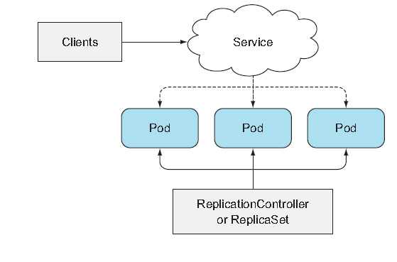

## Deployments: updating applications declaratively
Eventually, you're going to want to update your app. This chapter covers how to update apps running in a Kubernetes cluster and how Kubernetes helps you move toward a true zero-downtime update process. Deployments enable declarative application updates. 

### Updating applications running in pods
The following is how a basic application works in K8s.<br>
<br>

Initially, the pods run the first version(v1) of your application. And imagine now you developed a newer version tagged as v2.<br>
Because you can't change an existing pod's image after the pod is creted, you need to remove the old pods and replace them.<br>
For that, you have two ways:
- Delete all existing pods first and then start the new ones
- Start new ones and once they're up, delete the old ones. 
<br>

The first option will obviously lead to a short period of down-time. But at the same time, the second option requires your app<br>
to handle running two versions of the app, resulting in quite a lot of overhead.<br><br>

#### Deleting old pods and replacing them with new ones
<br><br>

You can easiliy replace old one with new one by modifying the pod template so it refers to version *v2*.<br>
This is the easiest if you wan accept the short downtime.

#### Spinning up new pods and then deleting the old ones
<br><br>

Pods are fronted by a Service. It's possible to have the Service front only the initial version.<br>
You first bring up the pods running the new version and then you can change the Service's label selector.<br>
This is called a ***blue-green deployment.***

    You can change a Service's pod selector with the "kubectl set selector"


#### Rolling update using two ReplicationControllers
<br><br>


#### Running the app and exposing it through a service using a single YAML file
kubia-rc-and-service-v1.yaml
```yaml
apiVersion: v1
kind: ReplicationController
metadata:
  name: migo-v1
spec:
  replicas: 3
  templates:
    metadata:
      name: migo
      labels:
        app: migo
    spec:
      containers:
        - image: saka1023/node_app:v1
          name: migo-con
---
apiVersion: v1
kind: Service
metadata:
  name: migo
spec:
  type: LoadBalancer
  selector:
    app: migo
  ports:
    - port: 80
      targetPort: 8080
```
Go ahead and post the YAML to k8s. Note that if you use LoadBalancer in Minikube, use "minikube tunnel" command.<br>
