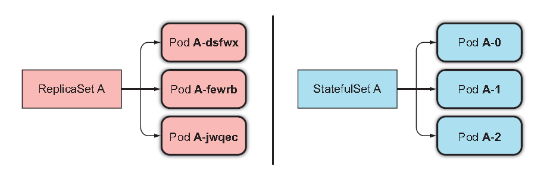
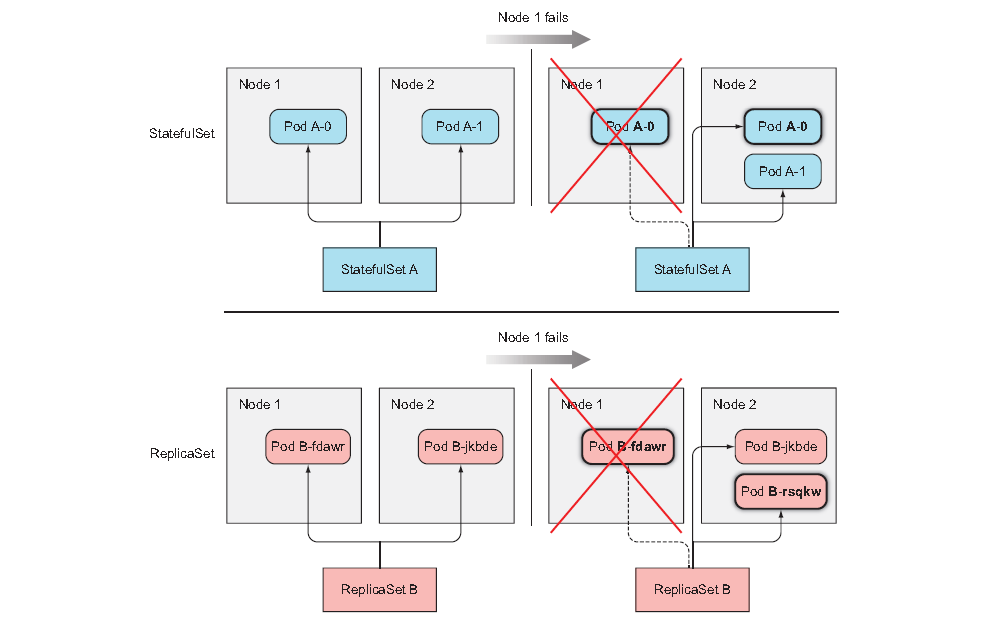
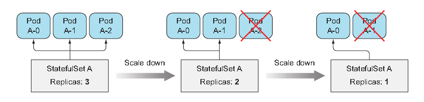

# StatefulSets: for 'stateful applications' 
Simple question. With what we've covered so far, can you employ a ReplicaSet to replicate the database pod? No. Here's why

## Replicationg stateful pods
ReplicaSets create multiple pod replicas from a single pod template; therefore the replicas don't differ from each apart from their name and IP address.
And more crucially, if the pod template includes a volume(which is necessary for database), all replicas will point to the same PVC and PV. 

You may be thinking of:
- **creating pods manually** : but then it's not gonna be rescheduled when they disappear!
- **using one replicaset per pod** : A lot of works to manage all of them and no scailability. 
- **using multiple directories in the same volume** : you can't tell each instance what directory they should use with shared storage volume being a bottleneck.

### Providing a stable identity for each pod
Pod can be killed time to time and replaced. But still a lot of, for example, NoSQL database require a stable network identity. 
For those kinds of applications, administrators need to list all the other cluster members and their IP in each membmer's configuration. 
So the IP address must be at least searchable or predictable.  

#### Using a dedicated service for each pod instance
How can you give a stable identity for each pod? 
You may be thinking of:
- providing each cluster member with dedicated Service object : similar idea to creating ReplicaSet for individual storage. 

But this solution is not only ugly but never do solve every problem such as individual pods not knowing which Service they are exposed through.  

Given all of these, Kubernetes devised a means to get around to this : **StatefulSets**

## Understanding StatefulSets
StatefulSets are specifically tailored to applications where instances of the apllications must be treated as **non-fungible** individuals. 
It makes sure pods are rescheduled in such a way that they retain their identity and state. 
It has also :
- replicas for desired replica count 
- template for pod

But then how can they have predictable identity? 

### Providing a stable network identity
Each pod created by a StatefulSet is assigned an **"ordinal index"**(zero-based) 

 

#### Introducing the governing service
But it's not all about the pods having a predictable name and hostname. 
stateful pods sometimes need to be addressable by their hostname.  
Plus, you would want to operate on a specific pod from the group because 
they differ from each other.  

For this reason, a Statefulset requires you to create a governing **headless Service,** 
which provides the actual network identity to each pod. 
Through this Service, each pod gets its own DNS entry, so its peers and other clients 
can address the pod by its hostname.  

For example, if governing Service belongs to the *default* namespace and called *foo*, 
and one of the pods is called *A-0*, you can reach the pod through its FQDN which is :

    a-0.foo.default.svc.cluster.local

Additionally, you can also use DNS to look up all the StatefulSet's pods names by looking up **SRV records** for the foo.default.svc.cluster.local domain. For your information, SRV is :

    Service record (SRV record) is a specification of data in the Domain Name System defining the location, i.e., the hostname and port number, of servers for specified services.

#### Replacing disconnected pods
StatefulSet makes sure the disconnected pods are replaced with a new instance. But in contrast to ReplicaSets, the replacement pod gets the same name and hostname as the pod that has disappeared.  
 

#### Scaling a StatefulSet
Scaling the StatefulSet creates a new pod instance with the next unused ordinal index. if you scale up from two to three instances, the new instance will get index 2.  

The nice thing about scaling down a StatefulSet is the fact that you know what pod will be removed.   
 

Note that StatefulSets scale down only one pod instance at a time in case distributed data store otherwise losing data.   
For the same erason, StatefulSet also never permit scale-down operations if any of the instances are unhealthy.

### Providing stable dedicated storage to each stateful instance
