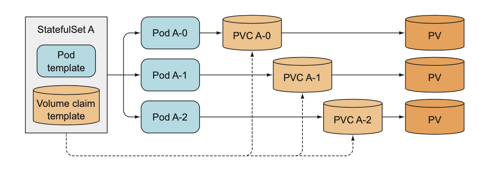
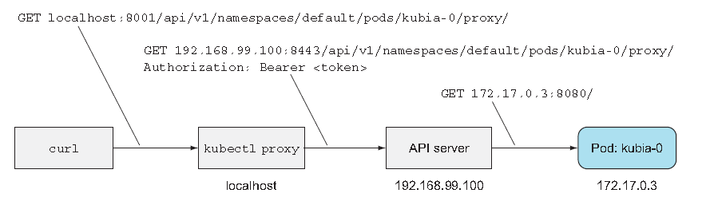
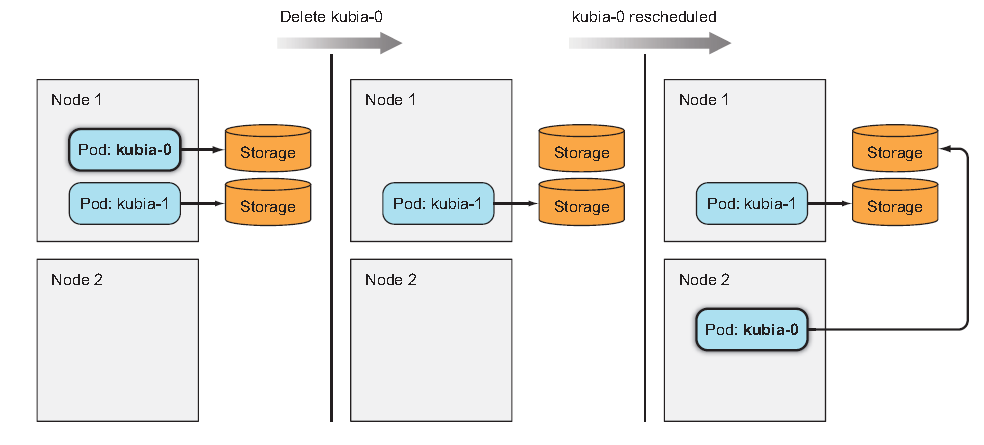
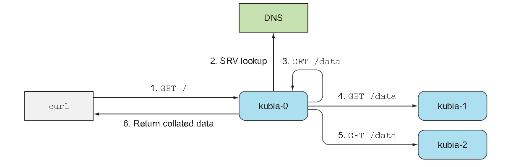

# StatefulSets: for 'stateful applications' 
Simple question. With what we've covered so far, can you employ a ReplicaSet to replicate the database pod? No. Here's why

## Replicationg stateful pods
ReplicaSets create multiple pod replicas from a single pod template; therefore the replicas don't differ from each apart from their name and IP address.
And more crucially, if the pod template includes a volume(which is necessary for database), all replicas will point to the same PVC and PV. 

You may be thinking of:
- **creating pods manually** : but then it's not gonna be rescheduled when they disappear!
- **using one replicaset per pod** : A lot of works to manage all of them and no scailability. 
- **using multiple directories in the same volume** : you can't tell each instance what directory they should use with shared storage volume being a bottleneck.

### Providing a stable identity for each pod
Pod can be killed time to time and replaced. But still a lot of, for example, NoSQL database require a stable network identity.<br>
For those kinds of applications, administrators need to list all the other cluster members and their IP in each membmer's configuration.<br>
So the IP address must be at least searchable or predictable. <br>

#### Using a dedicated service for each pod instance
How can you give a stable identity for each pod?<br>
You may be thinking of:
- providing each cluster member with dedicated Service object : similar idea to creating ReplicaSet for individual storage. 

But this solution is not only ugly but never do solve every problem such as individual pods not knowing which Service they are exposed through.<br><br>

Given all of these, Kubernetes devised a means to get around to this : **StatefulSets**

## Understanding StatefulSets
StatefulSets are specifically tailored to applications where instances of the apllications must be treated as **non-fungible** individuals.<br>
It makes sure pods are rescheduled in such a way that they retain their identity and state.<br>
It has also :
- replicas for desired replica count 
- template for pod

But then how can they have predictable identity? 

### Providing a stable network identity
Each pod created by a StatefulSet is assigned an **"ordinal index"**(zero-based)<br>

<br>

#### Introducing the governing service
But it's not all about the pods having a predictable name and hostname.<br>
stateful pods sometimes need to be addressable by their hostname. <br>
Plus, you would want to operate on a specific pod from the group because<br>
they differ from each other.<br><br>

For this reason, a Statefulset requires you to create a governing **headless Service,**<br>
which provides the actual network identity to each pod.<br>
Through this Service, each pod gets its own DNS entry, so its peers and other clients<br>
can address the pod by its hostname.<br><br>

For example, if governing Service belongs to the *default* namespace and called *foo*,<br>
and one of the pods is called *A-0*, you can reach the pod through its FQDN which is :

    a-0.foo.default.svc.cluster.local

Additionally, you can also use DNS to look up all the StatefulSet's pods names by looking up **SRV records** for the foo.default.svc.cluster.local domain. For your information, SRV is :

    Service record (SRV record) is a specification of data in the Domain Name System defining the location, i.e., the hostname and port number, of servers for specified services.


#### Replacing disconnected pods
StatefulSet makes sure the disconnected pods are replaced with a new instance. But in contrast to ReplicaSets, the replacement pod gets the same name and hostname as the pod that has disappeared. <br>
<br>


#### Scaling a StatefulSet
Scaling the StatefulSet creates a new pod instance with the next unused ordinal index. if you scale up from two to three instances, the new instance will get index 2.<br><br>

The nice thing about scaling down a StatefulSet is the fact that you know what pod will be removed. <br><br>
<br>

Note that StatefulSets scale down only one pod instance at a time in case distributed data store otherwise losing data. <br><br>
For the same erason, StatefulSet also never permit scale-down operations if any of the instances are unhealthy.

### Providing stable dedicated storage to each stateful instance
Now you've seen how to ensure stateful pods have a stable identity. But what about storage?<br>
Because PersistentVolumeClaims(PVCs) map to PersistentVolumes(PVs) one-to-one,<br>
each pod of a StatefulSet needs to reference a different PVC to have its own separate PersistentVolume.<br><br>

To do that, surely you're not expected to create as many PVCs as the number of pods you plan to have in<br>
StatefulSet upfront - of cource not. 

#### Teaming up Pod templates with VolumeClaim templates
<br>
The PVs for the claim can either be provisioned up-front or just in time through dynamic provisioning

#### Understanding the creation and deletion of PVCs
Scaling up a StatefulSet by one creates two or more API objects.<br>
Scaling down, however, deletes only the pod, leaving the claims alone.<br>
The reason for this is obvious; to protect the data stored in PV.<br>
For this reason, you're required to delete PVCs manually if in need.

#### Reattaching the PVC to the new instance of the same pod
The fact that the PVC remains after a scale-down means a subsequent scale-up can reattach the same claim along with the bound PV and its contents to the new pod instance. If you accidentally scale down a StatefulSet, you can und the mistake by scaling up again and the new pod will get the same persisted state again. <br>
<br>

### Understanding StatefulSet guarantees
Aside from stable identity and storage, StatefulSets also have different guarantees regarding their pods. 

#### Implications of stable identity and storage
While regular, stateless pods are fungible, stateful pods are NOT.<br>
Stateful pod is supposed to be replaced with an identical pod when things happen.<br>

    But what if K8S can't be sure about the state of the pod?

If it creates a replacement pod with the same identity, two instances of the app with the same identity might be running in the system.<br>
The two would also be bound to the same storage.

#### Introducing StatefulSet's At-Most-One-Semantics
K8S mut thus take great care to ensure two stateful pod instances are never running with the same identity.<br>
A StatefulSet must guarantee *at-most-one* semantics for stateful pod instances.<br>
What does that mean? 

    This means a StatefulSet must be absolutely certain that a pod is no longer running before it can create a replacement pod. 

Before we demonstrate this, you need to create a StatefulSet and see how it behaves. 

## Using a StatefulSet

### Creating the app and container image
To properly show StatefulSets in action, you'll build your own clustered data store.<br>
app1.js:
```js
const http = require('http');
const os = require('os');
const fs = require('fs');

const dataFile = "/var/data/migo.txt";

function fileExists(file) {
  try {
    fs.statSync(file);
    return true;
  } catch (e) {
    return false;
  }
}

var handler = function(request, response) {
  if (request.method == 'POST') {
    var file = fs.createWriteStream(dataFile);
    file.on('open', function (fd) {
      request.pipe(file);
      console.log("New data has been received and stored.");
      response.writeHead(200);
      response.end("Data stored on pod " + os.hostname() + "\n");
    });
  } else {
    var data = fileExists(dataFile) ? fs.readFileSync(dataFile, 'utf8') : "No data posted yet";
    response.writeHead(200);
    response.write("You've hit " + os.hostname() + "\n");
    response.end("Data stored on this pod: " + data + "\n");
  }
};

var www = http.createServer(handler);
www.listen(8080);
```
<br>

Dockerfile:
```Dockerfile
FROM node:7
ADD app.js /app.js
ENTRYPOINT ["node", "app.js"]
```
<br>

Pushing the image
```sh
docker build -t saka1023/state .
docker push saka1023/state
```


### Deploying the app through a StatefulSet
To deploy your app, you'll need to create two(or three) different types of objects:
- PVs (Only if your cluster doesn't support dynamic provisioning)
- A governing Service(headless)
- StatefulSet itself

#### Creating the persistent volumes
persistent-volumes-gcepd.yaml
```yaml
kind: List
apiVersion: v1
items:
- apiVersion: v1
  kind: PersistentVolume
  metadata: 
    name: pv-a
  spec:
    capacity:
      storage: 1Mi
    accessModes:
      - ReadWriteOnce
    persistentVolumeReclaimPolicy: Recycle
    gcePersistentDisk:
      pdName: pv-a
      fsType: nfs4
- apiVersion: v1
  kind: PersistentVolume
  metadata:
    name: pv-b
  spec:
    capacity:
      storage: 1Mi
    accessModes:
      - ReadWriteOnce
    persistentVolumeReclaimPolicy: Recycle
    gcePersistentDisk:
      pdName: pv-b
      fsType: ext4
- apiVersion: v1
  kind: PersistentVolume
  metadata:
    name: pv-c
  spec:
    capacity:
      storage: 1Mi
    accessModes:
      - ReadWriteOnce
    persistentVolumeReclaimPolicy: Recycle
    gcePersistentDisk:
      pdName: pv-c
      fsType: ext4
```
<br>

For minikube
```yaml
kind: List
apiVersion: v1
items:
- apiVersion: v1
  kind: PersistentVolume
  metadata:
    name: pv-a
  spec:
    capacity:
      storage: 1Mi
    accessModes:
      - ReadWriteOnce
    persistentVolumeReclaimPolicy: Recycle
    hostPath:
      path: /tmp/pv-a
- apiVersion: v1
  kind: PersistentVolume
  metadata:
    name: pv-b
  spec:
    capacity:
      storage: 1Mi
    accessModes:
      - ReadWriteOnce
    persistentVolumeReclaimPolicy: Recycle
    hostPath:
      path: /tmp/pv-b
- apiVersion: v1
  kind: PersistentVolume
  metadata:
    name: pv-c
  spec:
    capacity:
      storage: 1Mi
    accessModes:
      - ReadWriteOnce
    persistentVolumeReclaimPolicy: Recycle
    hostPath:
      path: /tmp/pv-c
```
<br>
Tips: three-dash line is equivalent to using 'kind: List' with 'items'

#### Creating the governing Service
You first need to create a headless Service
```yaml
apiVersion: v1
kind: Service
metadata: 
  name: migo-svc
spec: 
  clusterIP: None #This must be None
  selector:
    app: migo
  ports:
  - name: http
    port: 80
```
<br>

#### Creating the StatefulSet Manifest
```yaml
apiVersion: apps/v1
kind: StatefulSet
metadata:
  name: migo-state
spec:
  serviceName: migo-svc #What is this? The governing service?
  replicas: 2
  template:
    metadata:
      labels:
        app: migo
    spec:
      containers:
        - name: migo-con
          image: saka1023/state
          ports:
            - name: http
              containerPort: 8080
          volumeMounts:
            - name: data
              mountPath: /var/data
  volumeClaimTemplates:
    - metadata:
        name: data
      spec:
        resources:
          requests:
            storage: 1Mi
        accessModes:
          - ReadWriteOnce
```
StatefulSet manifest isn't that different from ReplicaSet or Deployment manifests except for    
    
    volumeClaimTemplates:

In it, you're defining one volume claim template called data.<br>

Previously, a pod references a claim by including a **persistentVolumeClaim** volume in the manifest.<br>
Here, you see no such thing appears.<br>

#### Creating StatefulSet

    kubectl apply -f stateful.yaml
    kubectl get po

You will see even though your StatefulSet is configured to create two replicas, it will create a single pod first.<br>
This is not wrong. The Second pod will be created not long after. StatefulSet behaves this way because<br>
certain applications are sensitive to race conditions. 


### Playing with you pods 
You can't communicate with your pods through the Service you just created because it's headless.<br>
If you want to first try out the pods, you can use API seerver as a proxy by hitting the following URL

    <apiVerserHost>:<port>/api/v1/namespacecs/default/pods/pod_name/proxy/<path>

But because API server is secured, you need to pass authorization token in each request, which you won't ever want.<br>
To avoid this, use the following

    kubectl proxy

Now, you can send a request to pod

    curl localhost:8001/api/v1/namespaces/default/pods/pod_name/proxy/

The way you interact with pod through API server and proxy is shown below.<br>
<br>

The request you sent was a GET request, but you can also send POST requests through the API server.

    curl -X POST -d "Hey there! this greeting was submitted to you!" localhost:8001/api/v1/namespaces/default/pods/pod_name/proxy/

The data you sent should now be stored in that pod. Let's see:

    curl -X GET localhost:8001/api/v1/namespaces/default/pods/pod_name/proxy/

What about the other node?

    curl -X GET localhost:8001/api/v1/namespaces/default/pods/other_pod_name/proxy/


#### Deleting the pod to see if the rescheduled pod is reattached to the same storage

    kubectl delete po pod_name

You should see a new pod with the same name is created.<br>
<br>

Let's check:

    curl -X GET localhost:8001/api/v1/namespaces/default/pods/pod_name/proxy/

#### Exposing Stateful Pods through a Regular, Non-Headless Service
Before you move on, you're going to add a proper, non-headless Service in front of your pods.<br>
because clients usually connect to the pods through a Non-headless Service rather than connecting them directly.<br>

  Headless Service + Non-Headless service?

  Yeah. That's how it is done. Through Non-Headless service, we want to do SRV lookup  that is 
  used inside the applications, And through regular Service, we will enable user to connect to pods. 

<br>

migo-service-public.yaml
```yaml
apiVersion: v1
kind: Service
metadata:
  name: migo-public
spec:
  selector:
    app: kubia
  ports:
    - port: 80
      targetPort: 8080
```
This is not externally exposed Service. You can only accecss it from inside the cluster.<br>

#### Connecting to cluster-internal services through the API server. 
You can use the same proxy feature provided by API server to access the service they way<br>
you've accessed individual pods, url of which looks like this:

  /api/v1/namespaces/{namespace}/services/{service_name}/proxy/

  #example
  curl localhost:8001/api/v1/namespaces/default/services/migo-public/proxy/

Of course, each request lands on a random cluster node. 


## Discovering peers in a StatefulSet
We still need to cover one more important thing; **peer discovery**.<br>
To put it in another way, we have to let them find other members of the cluster.<br>
Each member of a StatefulSet needs to easily find all the other members.<br>
You could do that by talking to API server, but one of K8S' aims is to expose<br>
features that help keep applications completely Kubernetes-agnostic.<br><br>

What then? How about DNS? Depending on how much you know about DNS, you probably<br>
understand what  
- A 
- CNAME 
- MX record 
are used for.<br>

### DNS?

  Note: DNS records are the elements that tell the DNS which URLs are associated with a given IP address.

  A Records are the most basic type. 
  The “A” stands for “Address,” as their function is to tie a domain name or URL directly to an IP address. 
  Here’s an example:

  Host Record         Points to           TTL
  localhost           127.0.0.1           4 hours
  store.website       10.108.11.45        4 hours

  CNAME is short for “Canonical Name.” 
  CNAME records are essentially aliases that tie one domain name to another. 
  For example, if you type “elegantthemes.com” into your browser, the DNS directs you to www.elegantthemes.com because there is an alias that points the former to the latter. CNAME records always point to either an A Record or another CNAME. Here’s what they look like:

  Host Record         Record Type	   Points to           TTL
  mydomain.com        A              127.0.0.1           4 hours
  store.website       CNAME          mydomain.com        4 hours
  ftp.mydomain.com    CNAME	         mydomain.com        4 hours


  Finally, MX or “Mail Exchange” records deal with sending email. 
  They tell the DNS where a particular email address is located. 

### SRV
Other lesser-known types of DNS records also exist:

  The DNS "service" (SRV) record specifies a host and "port" for specific services such as voice over IP (VoIP), instant messaging, and so on. 
  Most other DNS records only specify a server or an IP address, but SRV records include a port at that IP address as well.

  An example SRV record would actually look like:
  _xmpp._tcp.example.com.     86400     IN    SRV     10    5     5223    server.example.com.

  In the above example, "_xmpp" indicates the type of service (the XMPP protocol) and "_tcp" indicates the TCP transport protocol, while "example.com" is the host, or the domain name. "Server.example.com" is the target server and "5223" indicates the port within that server.

  SRV records must point to an A record (in IPv4) or an AAAA record (in IPv6). 
  The server name they list cannot be a CNAME. So "server.example.com" must lead directly to an A or AAAA record under that name.

### SRV in Kubernetes
Kubernetes creates SRV records to point to the hostnames of the pods backing a headless service.<br>
You're going to list the SRV records for your stateful pods by running the dig DNS lookup tool inside a new<br>
temporary pod. 

  kubectl run -it srvlookup --image=tutum/dnsutils --rm --restart=Never -- dig SRV headless_service_name.default.svc.cluster.local

- \-\-restart=Never : for a one-off pod
- \-\-rm : It will be deleted as sonn as it terminates. 

It will show you two section:
- ANSWER SECTION : SRV records pointing to the pods backing your headless service
- ADDITIONAL SECTION : A record given to pods.

For a pod to get a list of all the other pods of a StatefulSet, all you need to do is perform an SRV DNS lookup.<br>
In our Node.js for example, the lookup is performed like this:
```js
dns.resolveSrv("service FQDN", callBackFunction)
```

### Implementing peer discovery through DNS
The cluster can store multiple data entries but clients current have no good way to see all those entries.<br>
Because services forward requests to pods randomly, a client would need to perform many requests until it hits all the pods<br>
if it wanted to get the data from all the pods. <br><br>

You can improve this by having the node respond with data from all the cluster nodes. To do this, the node needs to find<br>
all its peers. To do that, you need to modify app's source code. <br>
app2.js:
```js

const http = require('http');
const os = require('os');
const fs = require('fs');
const dns = require('dns');

const dataFile = "/var/data/migo.txt"; //1
const serviceName = "kubia.default.svc.cluster.local";
const port = 8080;


function fileExists(file) { // file existence check
  try {
    fs.statSync(file);
    return true;
  } catch (e) {
    return false;
  }
}

function httpGet(reqOptions, callback) {
  return http.get(reqOptions, function(response) {
    var body = '';
    response.on('data', function(d) { body += d; });
    response.on('end', function() { callback(body); });
  }).on('error', function(e) {
    callback("Error: " + e.message);
  });
}

var handler = function(request, response) { //2
  if (request.method == 'POST') {
    var file = fs.createWriteStream(dataFile);
    file.on('open', function (fd) {
      request.pipe(file);
      console.log("New data has been received and stored.")
      response.writeHead(200);
      response.end("Data stored on pod " + os.hostname() + "\n");
    });
  } else {
    response.writeHead(200);
    if (request.url == '/data') {
      var data = fileExists(dataFile) ? fs.readFileSync(dataFile, 'utf8') : "No data posted yet";
      response.end(data);
    } else {
      response.write("You've hit " + os.hostname() + "\n");
      response.write("Data stored in the cluster:\n");
      dns.resolveSrv(serviceName, function (err, addresses) { // the app performs DNS lookup to optain SRV records
        if (err) {
          response.end("Could not look up DNS SRV records: " + err);
          return;
        }
        var numResponses = 0;
        if (addresses.length == 0) {
          response.end("No peers discovered.");
        } else {
          addresses.forEach(function (item) { // each pod pointed to by an SRV record is then contacted to get its data.
            var requestOptions = {
              host: item.name,
              port: port,
              path: '/data'
            };
            httpGet(requestOptions, function (returnedData) { // each pod pointed to by an SRV record is then contacted to get its data.
              numResponses++;
              response.write("- " + item.name + ": " + returnedData + "\n");
              if (numResponses == addresses.length) {
                response.end();
              }
            });
          });
        }
      });
    }
  }
};

var www = http.createServer(handler);
www.listen(port);

```

The following figure shows what happens when a GET request is received by your app.<br> 
<br>
- The server that receives the request first perform SRV record lookup.
- Then sends a GET request to each of the pods backing the service.
- Finally, it returns a list of all the nodes along with the data stored on each of them.

It seems quite similar to how ElasticSearch works. 

### Updating a StatefulSet
Do the following command

  kubectl edit statefulset migo

change 
- spec.replicas : 3
- spec.template.spec.containers.image: new image

  kubectl get po

The new pod instance should be running the new image now, but what about the existing two replicas?<br>
Starting from K8S vrsion 1.7, StatefulSets support rolling updates the same way Deployments and DaemonSets do.<br>
See the StatefulSet's *spec.updateStrategy* filed documentation using *kubectl explain*.


### Try-out!

  curl -XPOST -d "I'm such a nice guy" localhost:8001/api/v1/namespaces/default/services/migo-public/proxy/

  curl -XPOST -d "How sweet I am" localhost:8001/api/v1/namespaces/default/services/migo-public/proxy/

  #read data
  curl -XGET localhost:8001/api/v1/namespaces/default/services/migo-public/proxy/

When a client request reaches one of your nodes, it discovers all its peers, gathers data from them,<br> 
and sends all the data back to the client.

## Understanding how StatefulSets deal with node failures
Kubernetes must be absolutely sure that a statefulpod is no longer running before creating its replacement.<br>
To put it simply, it's not application running inside the Pods or Pods itself which report,<br> 
but **Kubelet** which stopped reporting the node's state to the master.<br><br>

With the node's network down, Kubelet running on the node can no longer contact the K8S API server.<br>
Then after a while, control plane will mark the "node" as *"NotReady"*, "pod" as "Unknown"<br>

### What if a failed node comes back online?
If the pod's status remain unknown for more than a few minutes(This is configurable),<br>
The pod is automatically evicted from the node. This is done by master(control plane)<br>

### Deleting the pod manually
You know the nod isn't coming back, but you need all the pods running to handle clients properly.<br>
Then you need to get the dead pod rescheduled to a healthy node.<br>
As mentioned earlier, you need to delete the node or pod **manually**.<br><br>

With that though, if you try to delete them, the chances are it's not deleted.<br>
In fact, the pod will have been makred for deletion even before you try to delete them.<br>
It will be removed as soon as the Kubelet on failed server gets back on, but with network down,<br>
They can never come back. **So you have to forcibly delete the pod.**

  kubectl delete po migo-0  --force --grace-period 0

Don't delete stateful pods forcibly unless you know what you are doing.
